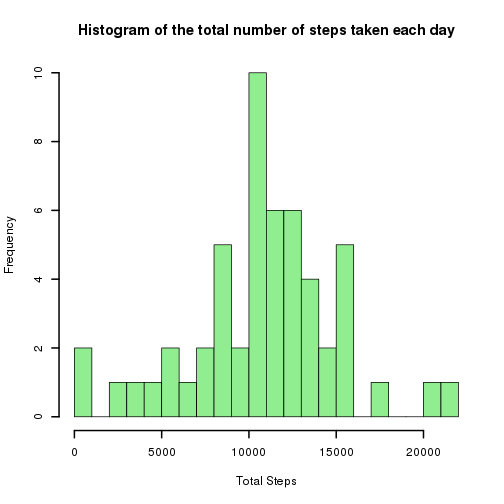
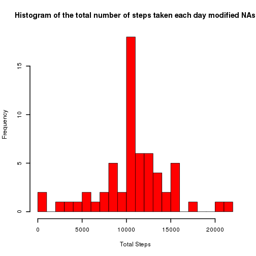
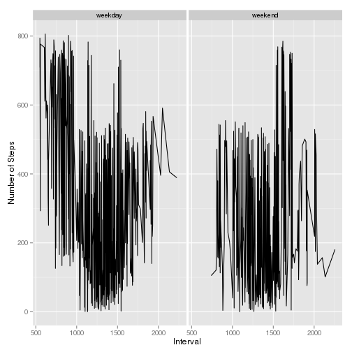

Reproducible Research: Peer Assessment 1
========================================
## Loading and preprocessing the data  

The code is downloaded from via a zipped URL and contains a CSV file:

### function to retrieve raw zip file

The zip file is loaded into a subdirectory data. The directory is created if it 
doesn't already exists.  
The zip file is saved as "monitoing.zip".  

```r
getdatafile <- function() {
        if(!file.exists("./data")){dir.create("./data")}
        fileURL <- "https://d396qusza40orc.cloudfront.net/repdata%2Fdata%2Factivity.zip"
        download.file(fileURL, destfile="./data/monitoring.zip",method="curl")
}
```
### function to extract required lines from zip file/file in zip file

The csv file is referenced and read through an unzip function.  
The file is not unzipped.  
The data.frame is returned to the caller.  

```r
readfromzip <- function() {
        data <- read.csv2(unz("./data/monitoring.zip", "activity.csv"), header=T,  stringsAsFactors=F, sep=",")
  data
}
```

### download and read in the data using these functions:  


```r
getdatafile()
activity <- readfromzip()
```


## What is the average daily activity pattern?  
Calculate the sum per day of each of the steps taken. (Give the column names a suitable name.)

```r
sumbyDay <- aggregate(activity$steps, list(activity$date), sum)
names(sumbyDay) <- c("date", "totalSteps")
```
Plot the histogram of the steps taken.  
histo1:

```r
hist(sumbyDay$totalSteps, breaks=30, main="Histogram of the total number of steps taken each day", xlab="Total Steps", col="lightgreen", lwd=2)
```

 

Now calculate the mean and median, ignoring the days with NA values.

```r
meanIgnoreNA <- round(mean(sumbyDay$totalSteps, na.rm=T))
medianIgnoreNA <- median(sumbyDay$totalSteps, na.rm=T)
```

The Mean value of the steps per day is 1.0766 &times; 10<sup>4</sup> and the median value is 10765.  

## Imputing missing values  

1. Total number of NAs  

```r
numNA <- sum(is.na(activity$steps))
numRows <- nrow(activity)
```
There is a 2304 rows with NA values out of a total of 17568 rows in total.

2. NA replacement strategy.  
There are complete days which are filled with NA values.  
The days with NA values are to be replaced with the mean value of the whole dataset.  First make a copy of the data set by calculating the sum per month first and then replace the NA values.  
3. create the new dataset  
There are only NAs in the steps column, none in the interval or date columns

```r
sumbyDay2 <- aggregate(activity$steps, list(activity$date), sum)
names(sumbyDay2) <- c("date", "totalSteps")
sumbyDay2[is.na(sumbyDay2)] <- meanIgnoreNA
```
sumbyDay2 now contains the same as sumbyDay with the NA months replaced by the mean.  

4. new histogram and mean and median created.  
newhist:

```r
hist(sumbyDay2$totalSteps, breaks=30, main="Histogram of the total number of steps taken each day modified NAs", xlab="Total Steps", col="red", lwd=2)
```

 

Calculate the new mean and median:

```r
mean2 <- round(mean(sumbyDay2$totalSteps, na.rm=T))
median2 <- median(sumbyDay2$totalSteps, na.rm=T)
```
The Mean value of the steps per day is 1.0766 &times; 10<sup>4</sup> and the median value is 1.0766 &times; 10<sup>4</sup>.  

The histogram has changed.  The replacement of the NA values with the average has increased the number of days with the average value. See the column has shifted from 10 to 15.  
The average is unaffected. The median *has* been affected. More points are in the middle, so it has shifted from **10765** to **10766**.


## Are there differences in activity patterns between weekdays and weekends?  
1. new factor varibale "weekday" and "weekend".  
create a new column with the name of the week (using *weekdays*) and use gsub with regular expressions to change this to **weekend** or **weekday**.

```r
library(ggplot2)
activity2 <- activity
activity2$weekday <- weekdays(as.Date(activity2$date))
activity2$weekday <- gsub("Monday|Tuesday|Wednesday|Thursday|Friday",
                         "weekday", activity2$weekday)

activity2$weekday <- gsub("Saturday|Sunday", "weekend", activity2$weekday)
j<-aggregate(activity2, by=list(activity2$steps, activity2$weekday), FUN=mean, na.rm=TRUE)
```

```
## Warning in mean.default(X[[1L]], ...): argument is not numeric or logical:
## returning NA
```

```
## Warning in mean.default(X[[2L]], ...): argument is not numeric or logical:
## returning NA
```

```
## Warning in mean.default(X[[3L]], ...): argument is not numeric or logical:
## returning NA
```

```
## Warning in mean.default(X[[4L]], ...): argument is not numeric or logical:
## returning NA
```

```
## Warning in mean.default(X[[5L]], ...): argument is not numeric or logical:
## returning NA
```

```
## Warning in mean.default(X[[6L]], ...): argument is not numeric or logical:
## returning NA
```

```
## Warning in mean.default(X[[7L]], ...): argument is not numeric or logical:
## returning NA
```

```
## Warning in mean.default(X[[8L]], ...): argument is not numeric or logical:
## returning NA
```

```
## Warning in mean.default(X[[9L]], ...): argument is not numeric or logical:
## returning NA
```

```
## Warning in mean.default(X[[10L]], ...): argument is not numeric or
## logical: returning NA
```

```
## Warning in mean.default(X[[11L]], ...): argument is not numeric or
## logical: returning NA
```

```
## Warning in mean.default(X[[12L]], ...): argument is not numeric or
## logical: returning NA
```

```
## Warning in mean.default(X[[13L]], ...): argument is not numeric or
## logical: returning NA
```

```
## Warning in mean.default(X[[14L]], ...): argument is not numeric or
## logical: returning NA
```

```
## Warning in mean.default(X[[15L]], ...): argument is not numeric or
## logical: returning NA
```

```
## Warning in mean.default(X[[16L]], ...): argument is not numeric or
## logical: returning NA
```

```
## Warning in mean.default(X[[17L]], ...): argument is not numeric or
## logical: returning NA
```

```
## Warning in mean.default(X[[18L]], ...): argument is not numeric or
## logical: returning NA
```

```
## Warning in mean.default(X[[19L]], ...): argument is not numeric or
## logical: returning NA
```

```
## Warning in mean.default(X[[20L]], ...): argument is not numeric or
## logical: returning NA
```

```
## Warning in mean.default(X[[21L]], ...): argument is not numeric or
## logical: returning NA
```

```
## Warning in mean.default(X[[22L]], ...): argument is not numeric or
## logical: returning NA
```

```
## Warning in mean.default(X[[23L]], ...): argument is not numeric or
## logical: returning NA
```

```
## Warning in mean.default(X[[24L]], ...): argument is not numeric or
## logical: returning NA
```

```
## Warning in mean.default(X[[25L]], ...): argument is not numeric or
## logical: returning NA
```

```
## Warning in mean.default(X[[26L]], ...): argument is not numeric or
## logical: returning NA
```

```
## Warning in mean.default(X[[27L]], ...): argument is not numeric or
## logical: returning NA
```

```
## Warning in mean.default(X[[28L]], ...): argument is not numeric or
## logical: returning NA
```

```
## Warning in mean.default(X[[29L]], ...): argument is not numeric or
## logical: returning NA
```

```
## Warning in mean.default(X[[30L]], ...): argument is not numeric or
## logical: returning NA
```

```
## Warning in mean.default(X[[31L]], ...): argument is not numeric or
## logical: returning NA
```

```
## Warning in mean.default(X[[32L]], ...): argument is not numeric or
## logical: returning NA
```

```
## Warning in mean.default(X[[33L]], ...): argument is not numeric or
## logical: returning NA
```

```
## Warning in mean.default(X[[34L]], ...): argument is not numeric or
## logical: returning NA
```

```
## Warning in mean.default(X[[35L]], ...): argument is not numeric or
## logical: returning NA
```

```
## Warning in mean.default(X[[36L]], ...): argument is not numeric or
## logical: returning NA
```

```
## Warning in mean.default(X[[37L]], ...): argument is not numeric or
## logical: returning NA
```

```
## Warning in mean.default(X[[38L]], ...): argument is not numeric or
## logical: returning NA
```

```
## Warning in mean.default(X[[39L]], ...): argument is not numeric or
## logical: returning NA
```

```
## Warning in mean.default(X[[40L]], ...): argument is not numeric or
## logical: returning NA
```

```
## Warning in mean.default(X[[41L]], ...): argument is not numeric or
## logical: returning NA
```

```
## Warning in mean.default(X[[42L]], ...): argument is not numeric or
## logical: returning NA
```

```
## Warning in mean.default(X[[43L]], ...): argument is not numeric or
## logical: returning NA
```

```
## Warning in mean.default(X[[44L]], ...): argument is not numeric or
## logical: returning NA
```

```
## Warning in mean.default(X[[45L]], ...): argument is not numeric or
## logical: returning NA
```

```
## Warning in mean.default(X[[46L]], ...): argument is not numeric or
## logical: returning NA
```

```
## Warning in mean.default(X[[47L]], ...): argument is not numeric or
## logical: returning NA
```

```
## Warning in mean.default(X[[48L]], ...): argument is not numeric or
## logical: returning NA
```

```
## Warning in mean.default(X[[49L]], ...): argument is not numeric or
## logical: returning NA
```

```
## Warning in mean.default(X[[50L]], ...): argument is not numeric or
## logical: returning NA
```

```
## Warning in mean.default(X[[51L]], ...): argument is not numeric or
## logical: returning NA
```

```
## Warning in mean.default(X[[52L]], ...): argument is not numeric or
## logical: returning NA
```

```
## Warning in mean.default(X[[53L]], ...): argument is not numeric or
## logical: returning NA
```

```
## Warning in mean.default(X[[54L]], ...): argument is not numeric or
## logical: returning NA
```

```
## Warning in mean.default(X[[55L]], ...): argument is not numeric or
## logical: returning NA
```

```
## Warning in mean.default(X[[56L]], ...): argument is not numeric or
## logical: returning NA
```

```
## Warning in mean.default(X[[57L]], ...): argument is not numeric or
## logical: returning NA
```

```
## Warning in mean.default(X[[58L]], ...): argument is not numeric or
## logical: returning NA
```

```
## Warning in mean.default(X[[59L]], ...): argument is not numeric or
## logical: returning NA
```

```
## Warning in mean.default(X[[60L]], ...): argument is not numeric or
## logical: returning NA
```

```
## Warning in mean.default(X[[61L]], ...): argument is not numeric or
## logical: returning NA
```

```
## Warning in mean.default(X[[62L]], ...): argument is not numeric or
## logical: returning NA
```

```
## Warning in mean.default(X[[63L]], ...): argument is not numeric or
## logical: returning NA
```

```
## Warning in mean.default(X[[64L]], ...): argument is not numeric or
## logical: returning NA
```

```
## Warning in mean.default(X[[65L]], ...): argument is not numeric or
## logical: returning NA
```

```
## Warning in mean.default(X[[66L]], ...): argument is not numeric or
## logical: returning NA
```

```
## Warning in mean.default(X[[67L]], ...): argument is not numeric or
## logical: returning NA
```

```
## Warning in mean.default(X[[68L]], ...): argument is not numeric or
## logical: returning NA
```

```
## Warning in mean.default(X[[69L]], ...): argument is not numeric or
## logical: returning NA
```

```
## Warning in mean.default(X[[70L]], ...): argument is not numeric or
## logical: returning NA
```

```
## Warning in mean.default(X[[71L]], ...): argument is not numeric or
## logical: returning NA
```

```
## Warning in mean.default(X[[72L]], ...): argument is not numeric or
## logical: returning NA
```

```
## Warning in mean.default(X[[73L]], ...): argument is not numeric or
## logical: returning NA
```

```
## Warning in mean.default(X[[74L]], ...): argument is not numeric or
## logical: returning NA
```

```
## Warning in mean.default(X[[75L]], ...): argument is not numeric or
## logical: returning NA
```

```
## Warning in mean.default(X[[76L]], ...): argument is not numeric or
## logical: returning NA
```

```
## Warning in mean.default(X[[77L]], ...): argument is not numeric or
## logical: returning NA
```

```
## Warning in mean.default(X[[78L]], ...): argument is not numeric or
## logical: returning NA
```

```
## Warning in mean.default(X[[79L]], ...): argument is not numeric or
## logical: returning NA
```

```
## Warning in mean.default(X[[80L]], ...): argument is not numeric or
## logical: returning NA
```

```
## Warning in mean.default(X[[81L]], ...): argument is not numeric or
## logical: returning NA
```

```
## Warning in mean.default(X[[82L]], ...): argument is not numeric or
## logical: returning NA
```

```
## Warning in mean.default(X[[83L]], ...): argument is not numeric or
## logical: returning NA
```

```
## Warning in mean.default(X[[84L]], ...): argument is not numeric or
## logical: returning NA
```

```
## Warning in mean.default(X[[85L]], ...): argument is not numeric or
## logical: returning NA
```

```
## Warning in mean.default(X[[86L]], ...): argument is not numeric or
## logical: returning NA
```

```
## Warning in mean.default(X[[87L]], ...): argument is not numeric or
## logical: returning NA
```

```
## Warning in mean.default(X[[88L]], ...): argument is not numeric or
## logical: returning NA
```

```
## Warning in mean.default(X[[89L]], ...): argument is not numeric or
## logical: returning NA
```

```
## Warning in mean.default(X[[90L]], ...): argument is not numeric or
## logical: returning NA
```

```
## Warning in mean.default(X[[91L]], ...): argument is not numeric or
## logical: returning NA
```

```
## Warning in mean.default(X[[92L]], ...): argument is not numeric or
## logical: returning NA
```

```
## Warning in mean.default(X[[93L]], ...): argument is not numeric or
## logical: returning NA
```

```
## Warning in mean.default(X[[94L]], ...): argument is not numeric or
## logical: returning NA
```

```
## Warning in mean.default(X[[95L]], ...): argument is not numeric or
## logical: returning NA
```

```
## Warning in mean.default(X[[96L]], ...): argument is not numeric or
## logical: returning NA
```

```
## Warning in mean.default(X[[97L]], ...): argument is not numeric or
## logical: returning NA
```

```
## Warning in mean.default(X[[98L]], ...): argument is not numeric or
## logical: returning NA
```

```
## Warning in mean.default(X[[99L]], ...): argument is not numeric or
## logical: returning NA
```

```
## Warning in mean.default(X[[100L]], ...): argument is not numeric or
## logical: returning NA
```

```
## Warning in mean.default(X[[101L]], ...): argument is not numeric or
## logical: returning NA
```

```
## Warning in mean.default(X[[102L]], ...): argument is not numeric or
## logical: returning NA
```

```
## Warning in mean.default(X[[103L]], ...): argument is not numeric or
## logical: returning NA
```

```
## Warning in mean.default(X[[104L]], ...): argument is not numeric or
## logical: returning NA
```

```
## Warning in mean.default(X[[105L]], ...): argument is not numeric or
## logical: returning NA
```

```
## Warning in mean.default(X[[106L]], ...): argument is not numeric or
## logical: returning NA
```

```
## Warning in mean.default(X[[107L]], ...): argument is not numeric or
## logical: returning NA
```

```
## Warning in mean.default(X[[108L]], ...): argument is not numeric or
## logical: returning NA
```

```
## Warning in mean.default(X[[109L]], ...): argument is not numeric or
## logical: returning NA
```

```
## Warning in mean.default(X[[110L]], ...): argument is not numeric or
## logical: returning NA
```

```
## Warning in mean.default(X[[111L]], ...): argument is not numeric or
## logical: returning NA
```

```
## Warning in mean.default(X[[112L]], ...): argument is not numeric or
## logical: returning NA
```

```
## Warning in mean.default(X[[113L]], ...): argument is not numeric or
## logical: returning NA
```

```
## Warning in mean.default(X[[114L]], ...): argument is not numeric or
## logical: returning NA
```

```
## Warning in mean.default(X[[115L]], ...): argument is not numeric or
## logical: returning NA
```

```
## Warning in mean.default(X[[116L]], ...): argument is not numeric or
## logical: returning NA
```

```
## Warning in mean.default(X[[117L]], ...): argument is not numeric or
## logical: returning NA
```

```
## Warning in mean.default(X[[118L]], ...): argument is not numeric or
## logical: returning NA
```

```
## Warning in mean.default(X[[119L]], ...): argument is not numeric or
## logical: returning NA
```

```
## Warning in mean.default(X[[120L]], ...): argument is not numeric or
## logical: returning NA
```

```
## Warning in mean.default(X[[121L]], ...): argument is not numeric or
## logical: returning NA
```

```
## Warning in mean.default(X[[122L]], ...): argument is not numeric or
## logical: returning NA
```

```
## Warning in mean.default(X[[123L]], ...): argument is not numeric or
## logical: returning NA
```

```
## Warning in mean.default(X[[124L]], ...): argument is not numeric or
## logical: returning NA
```

```
## Warning in mean.default(X[[125L]], ...): argument is not numeric or
## logical: returning NA
```

```
## Warning in mean.default(X[[126L]], ...): argument is not numeric or
## logical: returning NA
```

```
## Warning in mean.default(X[[127L]], ...): argument is not numeric or
## logical: returning NA
```

```
## Warning in mean.default(X[[128L]], ...): argument is not numeric or
## logical: returning NA
```

```
## Warning in mean.default(X[[129L]], ...): argument is not numeric or
## logical: returning NA
```

```
## Warning in mean.default(X[[130L]], ...): argument is not numeric or
## logical: returning NA
```

```
## Warning in mean.default(X[[131L]], ...): argument is not numeric or
## logical: returning NA
```

```
## Warning in mean.default(X[[132L]], ...): argument is not numeric or
## logical: returning NA
```

```
## Warning in mean.default(X[[133L]], ...): argument is not numeric or
## logical: returning NA
```

```
## Warning in mean.default(X[[134L]], ...): argument is not numeric or
## logical: returning NA
```

```
## Warning in mean.default(X[[135L]], ...): argument is not numeric or
## logical: returning NA
```

```
## Warning in mean.default(X[[136L]], ...): argument is not numeric or
## logical: returning NA
```

```
## Warning in mean.default(X[[137L]], ...): argument is not numeric or
## logical: returning NA
```

```
## Warning in mean.default(X[[138L]], ...): argument is not numeric or
## logical: returning NA
```

```
## Warning in mean.default(X[[139L]], ...): argument is not numeric or
## logical: returning NA
```

```
## Warning in mean.default(X[[140L]], ...): argument is not numeric or
## logical: returning NA
```

```
## Warning in mean.default(X[[141L]], ...): argument is not numeric or
## logical: returning NA
```

```
## Warning in mean.default(X[[142L]], ...): argument is not numeric or
## logical: returning NA
```

```
## Warning in mean.default(X[[143L]], ...): argument is not numeric or
## logical: returning NA
```

```
## Warning in mean.default(X[[144L]], ...): argument is not numeric or
## logical: returning NA
```

```
## Warning in mean.default(X[[145L]], ...): argument is not numeric or
## logical: returning NA
```

```
## Warning in mean.default(X[[146L]], ...): argument is not numeric or
## logical: returning NA
```

```
## Warning in mean.default(X[[147L]], ...): argument is not numeric or
## logical: returning NA
```

```
## Warning in mean.default(X[[148L]], ...): argument is not numeric or
## logical: returning NA
```

```
## Warning in mean.default(X[[149L]], ...): argument is not numeric or
## logical: returning NA
```

```
## Warning in mean.default(X[[150L]], ...): argument is not numeric or
## logical: returning NA
```

```
## Warning in mean.default(X[[151L]], ...): argument is not numeric or
## logical: returning NA
```

```
## Warning in mean.default(X[[152L]], ...): argument is not numeric or
## logical: returning NA
```

```
## Warning in mean.default(X[[153L]], ...): argument is not numeric or
## logical: returning NA
```

```
## Warning in mean.default(X[[154L]], ...): argument is not numeric or
## logical: returning NA
```

```
## Warning in mean.default(X[[155L]], ...): argument is not numeric or
## logical: returning NA
```

```
## Warning in mean.default(X[[156L]], ...): argument is not numeric or
## logical: returning NA
```

```
## Warning in mean.default(X[[157L]], ...): argument is not numeric or
## logical: returning NA
```

```
## Warning in mean.default(X[[158L]], ...): argument is not numeric or
## logical: returning NA
```

```
## Warning in mean.default(X[[159L]], ...): argument is not numeric or
## logical: returning NA
```

```
## Warning in mean.default(X[[160L]], ...): argument is not numeric or
## logical: returning NA
```

```
## Warning in mean.default(X[[161L]], ...): argument is not numeric or
## logical: returning NA
```

```
## Warning in mean.default(X[[162L]], ...): argument is not numeric or
## logical: returning NA
```

```
## Warning in mean.default(X[[163L]], ...): argument is not numeric or
## logical: returning NA
```

```
## Warning in mean.default(X[[164L]], ...): argument is not numeric or
## logical: returning NA
```

```
## Warning in mean.default(X[[165L]], ...): argument is not numeric or
## logical: returning NA
```

```
## Warning in mean.default(X[[166L]], ...): argument is not numeric or
## logical: returning NA
```

```
## Warning in mean.default(X[[167L]], ...): argument is not numeric or
## logical: returning NA
```

```
## Warning in mean.default(X[[168L]], ...): argument is not numeric or
## logical: returning NA
```

```
## Warning in mean.default(X[[169L]], ...): argument is not numeric or
## logical: returning NA
```

```
## Warning in mean.default(X[[170L]], ...): argument is not numeric or
## logical: returning NA
```

```
## Warning in mean.default(X[[171L]], ...): argument is not numeric or
## logical: returning NA
```

```
## Warning in mean.default(X[[172L]], ...): argument is not numeric or
## logical: returning NA
```

```
## Warning in mean.default(X[[173L]], ...): argument is not numeric or
## logical: returning NA
```

```
## Warning in mean.default(X[[174L]], ...): argument is not numeric or
## logical: returning NA
```

```
## Warning in mean.default(X[[175L]], ...): argument is not numeric or
## logical: returning NA
```

```
## Warning in mean.default(X[[176L]], ...): argument is not numeric or
## logical: returning NA
```

```
## Warning in mean.default(X[[177L]], ...): argument is not numeric or
## logical: returning NA
```

```
## Warning in mean.default(X[[178L]], ...): argument is not numeric or
## logical: returning NA
```

```
## Warning in mean.default(X[[179L]], ...): argument is not numeric or
## logical: returning NA
```

```
## Warning in mean.default(X[[180L]], ...): argument is not numeric or
## logical: returning NA
```

```
## Warning in mean.default(X[[181L]], ...): argument is not numeric or
## logical: returning NA
```

```
## Warning in mean.default(X[[182L]], ...): argument is not numeric or
## logical: returning NA
```

```
## Warning in mean.default(X[[183L]], ...): argument is not numeric or
## logical: returning NA
```

```
## Warning in mean.default(X[[184L]], ...): argument is not numeric or
## logical: returning NA
```

```
## Warning in mean.default(X[[185L]], ...): argument is not numeric or
## logical: returning NA
```

```
## Warning in mean.default(X[[186L]], ...): argument is not numeric or
## logical: returning NA
```

```
## Warning in mean.default(X[[187L]], ...): argument is not numeric or
## logical: returning NA
```

```
## Warning in mean.default(X[[188L]], ...): argument is not numeric or
## logical: returning NA
```

```
## Warning in mean.default(X[[189L]], ...): argument is not numeric or
## logical: returning NA
```

```
## Warning in mean.default(X[[190L]], ...): argument is not numeric or
## logical: returning NA
```

```
## Warning in mean.default(X[[191L]], ...): argument is not numeric or
## logical: returning NA
```

```
## Warning in mean.default(X[[192L]], ...): argument is not numeric or
## logical: returning NA
```

```
## Warning in mean.default(X[[193L]], ...): argument is not numeric or
## logical: returning NA
```

```
## Warning in mean.default(X[[194L]], ...): argument is not numeric or
## logical: returning NA
```

```
## Warning in mean.default(X[[195L]], ...): argument is not numeric or
## logical: returning NA
```

```
## Warning in mean.default(X[[196L]], ...): argument is not numeric or
## logical: returning NA
```

```
## Warning in mean.default(X[[197L]], ...): argument is not numeric or
## logical: returning NA
```

```
## Warning in mean.default(X[[198L]], ...): argument is not numeric or
## logical: returning NA
```

```
## Warning in mean.default(X[[199L]], ...): argument is not numeric or
## logical: returning NA
```

```
## Warning in mean.default(X[[200L]], ...): argument is not numeric or
## logical: returning NA
```

```
## Warning in mean.default(X[[201L]], ...): argument is not numeric or
## logical: returning NA
```

```
## Warning in mean.default(X[[202L]], ...): argument is not numeric or
## logical: returning NA
```

```
## Warning in mean.default(X[[203L]], ...): argument is not numeric or
## logical: returning NA
```

```
## Warning in mean.default(X[[204L]], ...): argument is not numeric or
## logical: returning NA
```

```
## Warning in mean.default(X[[205L]], ...): argument is not numeric or
## logical: returning NA
```

```
## Warning in mean.default(X[[206L]], ...): argument is not numeric or
## logical: returning NA
```

```
## Warning in mean.default(X[[207L]], ...): argument is not numeric or
## logical: returning NA
```

```
## Warning in mean.default(X[[208L]], ...): argument is not numeric or
## logical: returning NA
```

```
## Warning in mean.default(X[[209L]], ...): argument is not numeric or
## logical: returning NA
```

```
## Warning in mean.default(X[[210L]], ...): argument is not numeric or
## logical: returning NA
```

```
## Warning in mean.default(X[[211L]], ...): argument is not numeric or
## logical: returning NA
```

```
## Warning in mean.default(X[[212L]], ...): argument is not numeric or
## logical: returning NA
```

```
## Warning in mean.default(X[[213L]], ...): argument is not numeric or
## logical: returning NA
```

```
## Warning in mean.default(X[[214L]], ...): argument is not numeric or
## logical: returning NA
```

```
## Warning in mean.default(X[[215L]], ...): argument is not numeric or
## logical: returning NA
```

```
## Warning in mean.default(X[[216L]], ...): argument is not numeric or
## logical: returning NA
```

```
## Warning in mean.default(X[[217L]], ...): argument is not numeric or
## logical: returning NA
```

```
## Warning in mean.default(X[[218L]], ...): argument is not numeric or
## logical: returning NA
```

```
## Warning in mean.default(X[[219L]], ...): argument is not numeric or
## logical: returning NA
```

```
## Warning in mean.default(X[[220L]], ...): argument is not numeric or
## logical: returning NA
```

```
## Warning in mean.default(X[[221L]], ...): argument is not numeric or
## logical: returning NA
```

```
## Warning in mean.default(X[[222L]], ...): argument is not numeric or
## logical: returning NA
```

```
## Warning in mean.default(X[[223L]], ...): argument is not numeric or
## logical: returning NA
```

```
## Warning in mean.default(X[[224L]], ...): argument is not numeric or
## logical: returning NA
```

```
## Warning in mean.default(X[[225L]], ...): argument is not numeric or
## logical: returning NA
```

```
## Warning in mean.default(X[[226L]], ...): argument is not numeric or
## logical: returning NA
```

```
## Warning in mean.default(X[[227L]], ...): argument is not numeric or
## logical: returning NA
```

```
## Warning in mean.default(X[[228L]], ...): argument is not numeric or
## logical: returning NA
```

```
## Warning in mean.default(X[[229L]], ...): argument is not numeric or
## logical: returning NA
```

```
## Warning in mean.default(X[[230L]], ...): argument is not numeric or
## logical: returning NA
```

```
## Warning in mean.default(X[[231L]], ...): argument is not numeric or
## logical: returning NA
```

```
## Warning in mean.default(X[[232L]], ...): argument is not numeric or
## logical: returning NA
```

```
## Warning in mean.default(X[[233L]], ...): argument is not numeric or
## logical: returning NA
```

```
## Warning in mean.default(X[[234L]], ...): argument is not numeric or
## logical: returning NA
```

```
## Warning in mean.default(X[[235L]], ...): argument is not numeric or
## logical: returning NA
```

```
## Warning in mean.default(X[[236L]], ...): argument is not numeric or
## logical: returning NA
```

```
## Warning in mean.default(X[[237L]], ...): argument is not numeric or
## logical: returning NA
```

```
## Warning in mean.default(X[[238L]], ...): argument is not numeric or
## logical: returning NA
```

```
## Warning in mean.default(X[[239L]], ...): argument is not numeric or
## logical: returning NA
```

```
## Warning in mean.default(X[[240L]], ...): argument is not numeric or
## logical: returning NA
```

```
## Warning in mean.default(X[[241L]], ...): argument is not numeric or
## logical: returning NA
```

```
## Warning in mean.default(X[[242L]], ...): argument is not numeric or
## logical: returning NA
```

```
## Warning in mean.default(X[[243L]], ...): argument is not numeric or
## logical: returning NA
```

```
## Warning in mean.default(X[[244L]], ...): argument is not numeric or
## logical: returning NA
```

```
## Warning in mean.default(X[[245L]], ...): argument is not numeric or
## logical: returning NA
```

```
## Warning in mean.default(X[[246L]], ...): argument is not numeric or
## logical: returning NA
```

```
## Warning in mean.default(X[[247L]], ...): argument is not numeric or
## logical: returning NA
```

```
## Warning in mean.default(X[[248L]], ...): argument is not numeric or
## logical: returning NA
```

```
## Warning in mean.default(X[[249L]], ...): argument is not numeric or
## logical: returning NA
```

```
## Warning in mean.default(X[[250L]], ...): argument is not numeric or
## logical: returning NA
```

```
## Warning in mean.default(X[[251L]], ...): argument is not numeric or
## logical: returning NA
```

```
## Warning in mean.default(X[[252L]], ...): argument is not numeric or
## logical: returning NA
```

```
## Warning in mean.default(X[[253L]], ...): argument is not numeric or
## logical: returning NA
```

```
## Warning in mean.default(X[[254L]], ...): argument is not numeric or
## logical: returning NA
```

```
## Warning in mean.default(X[[255L]], ...): argument is not numeric or
## logical: returning NA
```

```
## Warning in mean.default(X[[256L]], ...): argument is not numeric or
## logical: returning NA
```

```
## Warning in mean.default(X[[257L]], ...): argument is not numeric or
## logical: returning NA
```

```
## Warning in mean.default(X[[258L]], ...): argument is not numeric or
## logical: returning NA
```

```
## Warning in mean.default(X[[259L]], ...): argument is not numeric or
## logical: returning NA
```

```
## Warning in mean.default(X[[260L]], ...): argument is not numeric or
## logical: returning NA
```

```
## Warning in mean.default(X[[261L]], ...): argument is not numeric or
## logical: returning NA
```

```
## Warning in mean.default(X[[262L]], ...): argument is not numeric or
## logical: returning NA
```

```
## Warning in mean.default(X[[263L]], ...): argument is not numeric or
## logical: returning NA
```

```
## Warning in mean.default(X[[264L]], ...): argument is not numeric or
## logical: returning NA
```

```
## Warning in mean.default(X[[265L]], ...): argument is not numeric or
## logical: returning NA
```

```
## Warning in mean.default(X[[266L]], ...): argument is not numeric or
## logical: returning NA
```

```
## Warning in mean.default(X[[267L]], ...): argument is not numeric or
## logical: returning NA
```

```
## Warning in mean.default(X[[268L]], ...): argument is not numeric or
## logical: returning NA
```

```
## Warning in mean.default(X[[269L]], ...): argument is not numeric or
## logical: returning NA
```

```
## Warning in mean.default(X[[270L]], ...): argument is not numeric or
## logical: returning NA
```

```
## Warning in mean.default(X[[271L]], ...): argument is not numeric or
## logical: returning NA
```

```
## Warning in mean.default(X[[272L]], ...): argument is not numeric or
## logical: returning NA
```

```
## Warning in mean.default(X[[273L]], ...): argument is not numeric or
## logical: returning NA
```

```
## Warning in mean.default(X[[274L]], ...): argument is not numeric or
## logical: returning NA
```

```
## Warning in mean.default(X[[275L]], ...): argument is not numeric or
## logical: returning NA
```

```
## Warning in mean.default(X[[276L]], ...): argument is not numeric or
## logical: returning NA
```

```
## Warning in mean.default(X[[277L]], ...): argument is not numeric or
## logical: returning NA
```

```
## Warning in mean.default(X[[278L]], ...): argument is not numeric or
## logical: returning NA
```

```
## Warning in mean.default(X[[279L]], ...): argument is not numeric or
## logical: returning NA
```

```
## Warning in mean.default(X[[280L]], ...): argument is not numeric or
## logical: returning NA
```

```
## Warning in mean.default(X[[281L]], ...): argument is not numeric or
## logical: returning NA
```

```
## Warning in mean.default(X[[282L]], ...): argument is not numeric or
## logical: returning NA
```

```
## Warning in mean.default(X[[283L]], ...): argument is not numeric or
## logical: returning NA
```

```
## Warning in mean.default(X[[284L]], ...): argument is not numeric or
## logical: returning NA
```

```
## Warning in mean.default(X[[285L]], ...): argument is not numeric or
## logical: returning NA
```

```
## Warning in mean.default(X[[286L]], ...): argument is not numeric or
## logical: returning NA
```

```
## Warning in mean.default(X[[287L]], ...): argument is not numeric or
## logical: returning NA
```

```
## Warning in mean.default(X[[288L]], ...): argument is not numeric or
## logical: returning NA
```

```
## Warning in mean.default(X[[289L]], ...): argument is not numeric or
## logical: returning NA
```

```
## Warning in mean.default(X[[290L]], ...): argument is not numeric or
## logical: returning NA
```

```
## Warning in mean.default(X[[291L]], ...): argument is not numeric or
## logical: returning NA
```

```
## Warning in mean.default(X[[292L]], ...): argument is not numeric or
## logical: returning NA
```

```
## Warning in mean.default(X[[293L]], ...): argument is not numeric or
## logical: returning NA
```

```
## Warning in mean.default(X[[294L]], ...): argument is not numeric or
## logical: returning NA
```

```
## Warning in mean.default(X[[295L]], ...): argument is not numeric or
## logical: returning NA
```

```
## Warning in mean.default(X[[296L]], ...): argument is not numeric or
## logical: returning NA
```

```
## Warning in mean.default(X[[297L]], ...): argument is not numeric or
## logical: returning NA
```

```
## Warning in mean.default(X[[298L]], ...): argument is not numeric or
## logical: returning NA
```

```
## Warning in mean.default(X[[299L]], ...): argument is not numeric or
## logical: returning NA
```

```
## Warning in mean.default(X[[300L]], ...): argument is not numeric or
## logical: returning NA
```

```
## Warning in mean.default(X[[301L]], ...): argument is not numeric or
## logical: returning NA
```

```
## Warning in mean.default(X[[302L]], ...): argument is not numeric or
## logical: returning NA
```

```
## Warning in mean.default(X[[303L]], ...): argument is not numeric or
## logical: returning NA
```

```
## Warning in mean.default(X[[304L]], ...): argument is not numeric or
## logical: returning NA
```

```
## Warning in mean.default(X[[305L]], ...): argument is not numeric or
## logical: returning NA
```

```
## Warning in mean.default(X[[306L]], ...): argument is not numeric or
## logical: returning NA
```

```
## Warning in mean.default(X[[307L]], ...): argument is not numeric or
## logical: returning NA
```

```
## Warning in mean.default(X[[308L]], ...): argument is not numeric or
## logical: returning NA
```

```
## Warning in mean.default(X[[309L]], ...): argument is not numeric or
## logical: returning NA
```

```
## Warning in mean.default(X[[310L]], ...): argument is not numeric or
## logical: returning NA
```

```
## Warning in mean.default(X[[311L]], ...): argument is not numeric or
## logical: returning NA
```

```
## Warning in mean.default(X[[312L]], ...): argument is not numeric or
## logical: returning NA
```

```
## Warning in mean.default(X[[313L]], ...): argument is not numeric or
## logical: returning NA
```

```
## Warning in mean.default(X[[314L]], ...): argument is not numeric or
## logical: returning NA
```

```
## Warning in mean.default(X[[315L]], ...): argument is not numeric or
## logical: returning NA
```

```
## Warning in mean.default(X[[316L]], ...): argument is not numeric or
## logical: returning NA
```

```
## Warning in mean.default(X[[317L]], ...): argument is not numeric or
## logical: returning NA
```

```
## Warning in mean.default(X[[318L]], ...): argument is not numeric or
## logical: returning NA
```

```
## Warning in mean.default(X[[319L]], ...): argument is not numeric or
## logical: returning NA
```

```
## Warning in mean.default(X[[320L]], ...): argument is not numeric or
## logical: returning NA
```

```
## Warning in mean.default(X[[321L]], ...): argument is not numeric or
## logical: returning NA
```

```
## Warning in mean.default(X[[322L]], ...): argument is not numeric or
## logical: returning NA
```

```
## Warning in mean.default(X[[323L]], ...): argument is not numeric or
## logical: returning NA
```

```
## Warning in mean.default(X[[324L]], ...): argument is not numeric or
## logical: returning NA
```

```
## Warning in mean.default(X[[325L]], ...): argument is not numeric or
## logical: returning NA
```

```
## Warning in mean.default(X[[326L]], ...): argument is not numeric or
## logical: returning NA
```

```
## Warning in mean.default(X[[327L]], ...): argument is not numeric or
## logical: returning NA
```

```
## Warning in mean.default(X[[328L]], ...): argument is not numeric or
## logical: returning NA
```

```
## Warning in mean.default(X[[329L]], ...): argument is not numeric or
## logical: returning NA
```

```
## Warning in mean.default(X[[330L]], ...): argument is not numeric or
## logical: returning NA
```

```
## Warning in mean.default(X[[331L]], ...): argument is not numeric or
## logical: returning NA
```

```
## Warning in mean.default(X[[332L]], ...): argument is not numeric or
## logical: returning NA
```

```
## Warning in mean.default(X[[333L]], ...): argument is not numeric or
## logical: returning NA
```

```
## Warning in mean.default(X[[334L]], ...): argument is not numeric or
## logical: returning NA
```

```
## Warning in mean.default(X[[335L]], ...): argument is not numeric or
## logical: returning NA
```

```
## Warning in mean.default(X[[336L]], ...): argument is not numeric or
## logical: returning NA
```

```
## Warning in mean.default(X[[337L]], ...): argument is not numeric or
## logical: returning NA
```

```
## Warning in mean.default(X[[338L]], ...): argument is not numeric or
## logical: returning NA
```

```
## Warning in mean.default(X[[339L]], ...): argument is not numeric or
## logical: returning NA
```

```
## Warning in mean.default(X[[340L]], ...): argument is not numeric or
## logical: returning NA
```

```
## Warning in mean.default(X[[341L]], ...): argument is not numeric or
## logical: returning NA
```

```
## Warning in mean.default(X[[342L]], ...): argument is not numeric or
## logical: returning NA
```

```
## Warning in mean.default(X[[343L]], ...): argument is not numeric or
## logical: returning NA
```

```
## Warning in mean.default(X[[344L]], ...): argument is not numeric or
## logical: returning NA
```

```
## Warning in mean.default(X[[345L]], ...): argument is not numeric or
## logical: returning NA
```

```
## Warning in mean.default(X[[346L]], ...): argument is not numeric or
## logical: returning NA
```

```
## Warning in mean.default(X[[347L]], ...): argument is not numeric or
## logical: returning NA
```

```
## Warning in mean.default(X[[348L]], ...): argument is not numeric or
## logical: returning NA
```

```
## Warning in mean.default(X[[349L]], ...): argument is not numeric or
## logical: returning NA
```

```
## Warning in mean.default(X[[350L]], ...): argument is not numeric or
## logical: returning NA
```

```
## Warning in mean.default(X[[351L]], ...): argument is not numeric or
## logical: returning NA
```

```
## Warning in mean.default(X[[352L]], ...): argument is not numeric or
## logical: returning NA
```

```
## Warning in mean.default(X[[353L]], ...): argument is not numeric or
## logical: returning NA
```

```
## Warning in mean.default(X[[354L]], ...): argument is not numeric or
## logical: returning NA
```

```
## Warning in mean.default(X[[355L]], ...): argument is not numeric or
## logical: returning NA
```

```
## Warning in mean.default(X[[356L]], ...): argument is not numeric or
## logical: returning NA
```

```
## Warning in mean.default(X[[357L]], ...): argument is not numeric or
## logical: returning NA
```

```
## Warning in mean.default(X[[358L]], ...): argument is not numeric or
## logical: returning NA
```

```
## Warning in mean.default(X[[359L]], ...): argument is not numeric or
## logical: returning NA
```

```
## Warning in mean.default(X[[360L]], ...): argument is not numeric or
## logical: returning NA
```

```
## Warning in mean.default(X[[361L]], ...): argument is not numeric or
## logical: returning NA
```

```
## Warning in mean.default(X[[362L]], ...): argument is not numeric or
## logical: returning NA
```

```
## Warning in mean.default(X[[363L]], ...): argument is not numeric or
## logical: returning NA
```

```
## Warning in mean.default(X[[364L]], ...): argument is not numeric or
## logical: returning NA
```

```
## Warning in mean.default(X[[365L]], ...): argument is not numeric or
## logical: returning NA
```

```
## Warning in mean.default(X[[366L]], ...): argument is not numeric or
## logical: returning NA
```

```
## Warning in mean.default(X[[367L]], ...): argument is not numeric or
## logical: returning NA
```

```
## Warning in mean.default(X[[368L]], ...): argument is not numeric or
## logical: returning NA
```

```
## Warning in mean.default(X[[369L]], ...): argument is not numeric or
## logical: returning NA
```

```
## Warning in mean.default(X[[370L]], ...): argument is not numeric or
## logical: returning NA
```

```
## Warning in mean.default(X[[371L]], ...): argument is not numeric or
## logical: returning NA
```

```
## Warning in mean.default(X[[372L]], ...): argument is not numeric or
## logical: returning NA
```

```
## Warning in mean.default(X[[373L]], ...): argument is not numeric or
## logical: returning NA
```

```
## Warning in mean.default(X[[374L]], ...): argument is not numeric or
## logical: returning NA
```

```
## Warning in mean.default(X[[375L]], ...): argument is not numeric or
## logical: returning NA
```

```
## Warning in mean.default(X[[376L]], ...): argument is not numeric or
## logical: returning NA
```

```
## Warning in mean.default(X[[377L]], ...): argument is not numeric or
## logical: returning NA
```

```
## Warning in mean.default(X[[378L]], ...): argument is not numeric or
## logical: returning NA
```

```
## Warning in mean.default(X[[379L]], ...): argument is not numeric or
## logical: returning NA
```

```
## Warning in mean.default(X[[380L]], ...): argument is not numeric or
## logical: returning NA
```

```
## Warning in mean.default(X[[381L]], ...): argument is not numeric or
## logical: returning NA
```

```
## Warning in mean.default(X[[382L]], ...): argument is not numeric or
## logical: returning NA
```

```
## Warning in mean.default(X[[383L]], ...): argument is not numeric or
## logical: returning NA
```

```
## Warning in mean.default(X[[384L]], ...): argument is not numeric or
## logical: returning NA
```

```
## Warning in mean.default(X[[385L]], ...): argument is not numeric or
## logical: returning NA
```

```
## Warning in mean.default(X[[386L]], ...): argument is not numeric or
## logical: returning NA
```

```
## Warning in mean.default(X[[387L]], ...): argument is not numeric or
## logical: returning NA
```

```
## Warning in mean.default(X[[388L]], ...): argument is not numeric or
## logical: returning NA
```

```
## Warning in mean.default(X[[389L]], ...): argument is not numeric or
## logical: returning NA
```

```
## Warning in mean.default(X[[390L]], ...): argument is not numeric or
## logical: returning NA
```

```
## Warning in mean.default(X[[391L]], ...): argument is not numeric or
## logical: returning NA
```

```
## Warning in mean.default(X[[392L]], ...): argument is not numeric or
## logical: returning NA
```

```
## Warning in mean.default(X[[393L]], ...): argument is not numeric or
## logical: returning NA
```

```
## Warning in mean.default(X[[394L]], ...): argument is not numeric or
## logical: returning NA
```

```
## Warning in mean.default(X[[395L]], ...): argument is not numeric or
## logical: returning NA
```

```
## Warning in mean.default(X[[396L]], ...): argument is not numeric or
## logical: returning NA
```

```
## Warning in mean.default(X[[397L]], ...): argument is not numeric or
## logical: returning NA
```

```
## Warning in mean.default(X[[398L]], ...): argument is not numeric or
## logical: returning NA
```

```
## Warning in mean.default(X[[399L]], ...): argument is not numeric or
## logical: returning NA
```

```
## Warning in mean.default(X[[400L]], ...): argument is not numeric or
## logical: returning NA
```

```
## Warning in mean.default(X[[401L]], ...): argument is not numeric or
## logical: returning NA
```

```
## Warning in mean.default(X[[402L]], ...): argument is not numeric or
## logical: returning NA
```

```
## Warning in mean.default(X[[403L]], ...): argument is not numeric or
## logical: returning NA
```

```
## Warning in mean.default(X[[404L]], ...): argument is not numeric or
## logical: returning NA
```

```
## Warning in mean.default(X[[405L]], ...): argument is not numeric or
## logical: returning NA
```

```
## Warning in mean.default(X[[406L]], ...): argument is not numeric or
## logical: returning NA
```

```
## Warning in mean.default(X[[407L]], ...): argument is not numeric or
## logical: returning NA
```

```
## Warning in mean.default(X[[408L]], ...): argument is not numeric or
## logical: returning NA
```

```
## Warning in mean.default(X[[409L]], ...): argument is not numeric or
## logical: returning NA
```

```
## Warning in mean.default(X[[410L]], ...): argument is not numeric or
## logical: returning NA
```

```
## Warning in mean.default(X[[411L]], ...): argument is not numeric or
## logical: returning NA
```

```
## Warning in mean.default(X[[412L]], ...): argument is not numeric or
## logical: returning NA
```

```
## Warning in mean.default(X[[413L]], ...): argument is not numeric or
## logical: returning NA
```

```
## Warning in mean.default(X[[414L]], ...): argument is not numeric or
## logical: returning NA
```

```
## Warning in mean.default(X[[415L]], ...): argument is not numeric or
## logical: returning NA
```

```
## Warning in mean.default(X[[416L]], ...): argument is not numeric or
## logical: returning NA
```

```
## Warning in mean.default(X[[417L]], ...): argument is not numeric or
## logical: returning NA
```

```
## Warning in mean.default(X[[418L]], ...): argument is not numeric or
## logical: returning NA
```

```
## Warning in mean.default(X[[419L]], ...): argument is not numeric or
## logical: returning NA
```

```
## Warning in mean.default(X[[420L]], ...): argument is not numeric or
## logical: returning NA
```

```
## Warning in mean.default(X[[421L]], ...): argument is not numeric or
## logical: returning NA
```

```
## Warning in mean.default(X[[422L]], ...): argument is not numeric or
## logical: returning NA
```

```
## Warning in mean.default(X[[423L]], ...): argument is not numeric or
## logical: returning NA
```

```
## Warning in mean.default(X[[424L]], ...): argument is not numeric or
## logical: returning NA
```

```
## Warning in mean.default(X[[425L]], ...): argument is not numeric or
## logical: returning NA
```

```
## Warning in mean.default(X[[426L]], ...): argument is not numeric or
## logical: returning NA
```

```
## Warning in mean.default(X[[427L]], ...): argument is not numeric or
## logical: returning NA
```

```
## Warning in mean.default(X[[428L]], ...): argument is not numeric or
## logical: returning NA
```

```
## Warning in mean.default(X[[429L]], ...): argument is not numeric or
## logical: returning NA
```

```
## Warning in mean.default(X[[430L]], ...): argument is not numeric or
## logical: returning NA
```

```
## Warning in mean.default(X[[431L]], ...): argument is not numeric or
## logical: returning NA
```

```
## Warning in mean.default(X[[432L]], ...): argument is not numeric or
## logical: returning NA
```

```
## Warning in mean.default(X[[433L]], ...): argument is not numeric or
## logical: returning NA
```

```
## Warning in mean.default(X[[434L]], ...): argument is not numeric or
## logical: returning NA
```

```
## Warning in mean.default(X[[435L]], ...): argument is not numeric or
## logical: returning NA
```

```
## Warning in mean.default(X[[436L]], ...): argument is not numeric or
## logical: returning NA
```

```
## Warning in mean.default(X[[437L]], ...): argument is not numeric or
## logical: returning NA
```

```
## Warning in mean.default(X[[438L]], ...): argument is not numeric or
## logical: returning NA
```

```
## Warning in mean.default(X[[439L]], ...): argument is not numeric or
## logical: returning NA
```

```
## Warning in mean.default(X[[440L]], ...): argument is not numeric or
## logical: returning NA
```

```
## Warning in mean.default(X[[441L]], ...): argument is not numeric or
## logical: returning NA
```

```
## Warning in mean.default(X[[442L]], ...): argument is not numeric or
## logical: returning NA
```

```
## Warning in mean.default(X[[443L]], ...): argument is not numeric or
## logical: returning NA
```

```
## Warning in mean.default(X[[444L]], ...): argument is not numeric or
## logical: returning NA
```

```
## Warning in mean.default(X[[445L]], ...): argument is not numeric or
## logical: returning NA
```

```
## Warning in mean.default(X[[446L]], ...): argument is not numeric or
## logical: returning NA
```

```
## Warning in mean.default(X[[447L]], ...): argument is not numeric or
## logical: returning NA
```

```
## Warning in mean.default(X[[448L]], ...): argument is not numeric or
## logical: returning NA
```

```
## Warning in mean.default(X[[449L]], ...): argument is not numeric or
## logical: returning NA
```

```
## Warning in mean.default(X[[450L]], ...): argument is not numeric or
## logical: returning NA
```

```
## Warning in mean.default(X[[451L]], ...): argument is not numeric or
## logical: returning NA
```

```
## Warning in mean.default(X[[452L]], ...): argument is not numeric or
## logical: returning NA
```

```
## Warning in mean.default(X[[453L]], ...): argument is not numeric or
## logical: returning NA
```

```
## Warning in mean.default(X[[454L]], ...): argument is not numeric or
## logical: returning NA
```

```
## Warning in mean.default(X[[455L]], ...): argument is not numeric or
## logical: returning NA
```

```
## Warning in mean.default(X[[456L]], ...): argument is not numeric or
## logical: returning NA
```

```
## Warning in mean.default(X[[457L]], ...): argument is not numeric or
## logical: returning NA
```

```
## Warning in mean.default(X[[458L]], ...): argument is not numeric or
## logical: returning NA
```

```
## Warning in mean.default(X[[459L]], ...): argument is not numeric or
## logical: returning NA
```

```
## Warning in mean.default(X[[460L]], ...): argument is not numeric or
## logical: returning NA
```

```
## Warning in mean.default(X[[461L]], ...): argument is not numeric or
## logical: returning NA
```

```
## Warning in mean.default(X[[462L]], ...): argument is not numeric or
## logical: returning NA
```

```
## Warning in mean.default(X[[463L]], ...): argument is not numeric or
## logical: returning NA
```

```
## Warning in mean.default(X[[464L]], ...): argument is not numeric or
## logical: returning NA
```

```
## Warning in mean.default(X[[465L]], ...): argument is not numeric or
## logical: returning NA
```

```
## Warning in mean.default(X[[466L]], ...): argument is not numeric or
## logical: returning NA
```

```
## Warning in mean.default(X[[467L]], ...): argument is not numeric or
## logical: returning NA
```

```
## Warning in mean.default(X[[468L]], ...): argument is not numeric or
## logical: returning NA
```

```
## Warning in mean.default(X[[469L]], ...): argument is not numeric or
## logical: returning NA
```

```
## Warning in mean.default(X[[470L]], ...): argument is not numeric or
## logical: returning NA
```

```
## Warning in mean.default(X[[471L]], ...): argument is not numeric or
## logical: returning NA
```

```
## Warning in mean.default(X[[472L]], ...): argument is not numeric or
## logical: returning NA
```

```
## Warning in mean.default(X[[473L]], ...): argument is not numeric or
## logical: returning NA
```

```
## Warning in mean.default(X[[474L]], ...): argument is not numeric or
## logical: returning NA
```

```
## Warning in mean.default(X[[475L]], ...): argument is not numeric or
## logical: returning NA
```

```
## Warning in mean.default(X[[476L]], ...): argument is not numeric or
## logical: returning NA
```

```
## Warning in mean.default(X[[477L]], ...): argument is not numeric or
## logical: returning NA
```

```
## Warning in mean.default(X[[478L]], ...): argument is not numeric or
## logical: returning NA
```

```
## Warning in mean.default(X[[479L]], ...): argument is not numeric or
## logical: returning NA
```

```
## Warning in mean.default(X[[480L]], ...): argument is not numeric or
## logical: returning NA
```

```
## Warning in mean.default(X[[481L]], ...): argument is not numeric or
## logical: returning NA
```

```
## Warning in mean.default(X[[482L]], ...): argument is not numeric or
## logical: returning NA
```

```
## Warning in mean.default(X[[483L]], ...): argument is not numeric or
## logical: returning NA
```

```
## Warning in mean.default(X[[484L]], ...): argument is not numeric or
## logical: returning NA
```

```
## Warning in mean.default(X[[485L]], ...): argument is not numeric or
## logical: returning NA
```

```
## Warning in mean.default(X[[486L]], ...): argument is not numeric or
## logical: returning NA
```

```
## Warning in mean.default(X[[487L]], ...): argument is not numeric or
## logical: returning NA
```

```
## Warning in mean.default(X[[488L]], ...): argument is not numeric or
## logical: returning NA
```

```
## Warning in mean.default(X[[489L]], ...): argument is not numeric or
## logical: returning NA
```

```
## Warning in mean.default(X[[490L]], ...): argument is not numeric or
## logical: returning NA
```

```
## Warning in mean.default(X[[491L]], ...): argument is not numeric or
## logical: returning NA
```

```
## Warning in mean.default(X[[492L]], ...): argument is not numeric or
## logical: returning NA
```

```
## Warning in mean.default(X[[493L]], ...): argument is not numeric or
## logical: returning NA
```

```
## Warning in mean.default(X[[494L]], ...): argument is not numeric or
## logical: returning NA
```

```
## Warning in mean.default(X[[495L]], ...): argument is not numeric or
## logical: returning NA
```

```
## Warning in mean.default(X[[496L]], ...): argument is not numeric or
## logical: returning NA
```

```
## Warning in mean.default(X[[497L]], ...): argument is not numeric or
## logical: returning NA
```

```
## Warning in mean.default(X[[498L]], ...): argument is not numeric or
## logical: returning NA
```

```
## Warning in mean.default(X[[499L]], ...): argument is not numeric or
## logical: returning NA
```

```
## Warning in mean.default(X[[500L]], ...): argument is not numeric or
## logical: returning NA
```

```
## Warning in mean.default(X[[501L]], ...): argument is not numeric or
## logical: returning NA
```

```
## Warning in mean.default(X[[502L]], ...): argument is not numeric or
## logical: returning NA
```

```
## Warning in mean.default(X[[503L]], ...): argument is not numeric or
## logical: returning NA
```

```
## Warning in mean.default(X[[504L]], ...): argument is not numeric or
## logical: returning NA
```

```
## Warning in mean.default(X[[505L]], ...): argument is not numeric or
## logical: returning NA
```

```
## Warning in mean.default(X[[506L]], ...): argument is not numeric or
## logical: returning NA
```

```
## Warning in mean.default(X[[507L]], ...): argument is not numeric or
## logical: returning NA
```

```
## Warning in mean.default(X[[508L]], ...): argument is not numeric or
## logical: returning NA
```

```
## Warning in mean.default(X[[509L]], ...): argument is not numeric or
## logical: returning NA
```

```
## Warning in mean.default(X[[510L]], ...): argument is not numeric or
## logical: returning NA
```

```
## Warning in mean.default(X[[511L]], ...): argument is not numeric or
## logical: returning NA
```

```
## Warning in mean.default(X[[512L]], ...): argument is not numeric or
## logical: returning NA
```

```
## Warning in mean.default(X[[513L]], ...): argument is not numeric or
## logical: returning NA
```

```
## Warning in mean.default(X[[514L]], ...): argument is not numeric or
## logical: returning NA
```

```
## Warning in mean.default(X[[515L]], ...): argument is not numeric or
## logical: returning NA
```

```
## Warning in mean.default(X[[516L]], ...): argument is not numeric or
## logical: returning NA
```

```
## Warning in mean.default(X[[517L]], ...): argument is not numeric or
## logical: returning NA
```

```
## Warning in mean.default(X[[518L]], ...): argument is not numeric or
## logical: returning NA
```

```
## Warning in mean.default(X[[519L]], ...): argument is not numeric or
## logical: returning NA
```

```
## Warning in mean.default(X[[520L]], ...): argument is not numeric or
## logical: returning NA
```

```
## Warning in mean.default(X[[521L]], ...): argument is not numeric or
## logical: returning NA
```

```
## Warning in mean.default(X[[522L]], ...): argument is not numeric or
## logical: returning NA
```

```
## Warning in mean.default(X[[523L]], ...): argument is not numeric or
## logical: returning NA
```

```
## Warning in mean.default(X[[524L]], ...): argument is not numeric or
## logical: returning NA
```

```
## Warning in mean.default(X[[525L]], ...): argument is not numeric or
## logical: returning NA
```

```
## Warning in mean.default(X[[526L]], ...): argument is not numeric or
## logical: returning NA
```

```
## Warning in mean.default(X[[527L]], ...): argument is not numeric or
## logical: returning NA
```

```
## Warning in mean.default(X[[528L]], ...): argument is not numeric or
## logical: returning NA
```

```
## Warning in mean.default(X[[529L]], ...): argument is not numeric or
## logical: returning NA
```

```
## Warning in mean.default(X[[530L]], ...): argument is not numeric or
## logical: returning NA
```

```
## Warning in mean.default(X[[531L]], ...): argument is not numeric or
## logical: returning NA
```

```
## Warning in mean.default(X[[532L]], ...): argument is not numeric or
## logical: returning NA
```

```
## Warning in mean.default(X[[533L]], ...): argument is not numeric or
## logical: returning NA
```

```
## Warning in mean.default(X[[534L]], ...): argument is not numeric or
## logical: returning NA
```

```
## Warning in mean.default(X[[535L]], ...): argument is not numeric or
## logical: returning NA
```

```
## Warning in mean.default(X[[536L]], ...): argument is not numeric or
## logical: returning NA
```

```
## Warning in mean.default(X[[537L]], ...): argument is not numeric or
## logical: returning NA
```

```
## Warning in mean.default(X[[538L]], ...): argument is not numeric or
## logical: returning NA
```

```
## Warning in mean.default(X[[539L]], ...): argument is not numeric or
## logical: returning NA
```

```
## Warning in mean.default(X[[540L]], ...): argument is not numeric or
## logical: returning NA
```

```
## Warning in mean.default(X[[541L]], ...): argument is not numeric or
## logical: returning NA
```

```
## Warning in mean.default(X[[542L]], ...): argument is not numeric or
## logical: returning NA
```

```
## Warning in mean.default(X[[543L]], ...): argument is not numeric or
## logical: returning NA
```

```
## Warning in mean.default(X[[544L]], ...): argument is not numeric or
## logical: returning NA
```

```
## Warning in mean.default(X[[545L]], ...): argument is not numeric or
## logical: returning NA
```

```
## Warning in mean.default(X[[546L]], ...): argument is not numeric or
## logical: returning NA
```

```
## Warning in mean.default(X[[547L]], ...): argument is not numeric or
## logical: returning NA
```

```
## Warning in mean.default(X[[548L]], ...): argument is not numeric or
## logical: returning NA
```

```
## Warning in mean.default(X[[549L]], ...): argument is not numeric or
## logical: returning NA
```

```
## Warning in mean.default(X[[550L]], ...): argument is not numeric or
## logical: returning NA
```

```
## Warning in mean.default(X[[551L]], ...): argument is not numeric or
## logical: returning NA
```

```
## Warning in mean.default(X[[552L]], ...): argument is not numeric or
## logical: returning NA
```

```
## Warning in mean.default(X[[553L]], ...): argument is not numeric or
## logical: returning NA
```

```
## Warning in mean.default(X[[554L]], ...): argument is not numeric or
## logical: returning NA
```

```
## Warning in mean.default(X[[555L]], ...): argument is not numeric or
## logical: returning NA
```

```
## Warning in mean.default(X[[556L]], ...): argument is not numeric or
## logical: returning NA
```

```
## Warning in mean.default(X[[557L]], ...): argument is not numeric or
## logical: returning NA
```

```
## Warning in mean.default(X[[558L]], ...): argument is not numeric or
## logical: returning NA
```

```
## Warning in mean.default(X[[559L]], ...): argument is not numeric or
## logical: returning NA
```

```
## Warning in mean.default(X[[560L]], ...): argument is not numeric or
## logical: returning NA
```

```
## Warning in mean.default(X[[561L]], ...): argument is not numeric or
## logical: returning NA
```

```
## Warning in mean.default(X[[562L]], ...): argument is not numeric or
## logical: returning NA
```

```
## Warning in mean.default(X[[563L]], ...): argument is not numeric or
## logical: returning NA
```

```
## Warning in mean.default(X[[564L]], ...): argument is not numeric or
## logical: returning NA
```

```
## Warning in mean.default(X[[565L]], ...): argument is not numeric or
## logical: returning NA
```

```
## Warning in mean.default(X[[566L]], ...): argument is not numeric or
## logical: returning NA
```

```
## Warning in mean.default(X[[567L]], ...): argument is not numeric or
## logical: returning NA
```

```
## Warning in mean.default(X[[568L]], ...): argument is not numeric or
## logical: returning NA
```

```
## Warning in mean.default(X[[569L]], ...): argument is not numeric or
## logical: returning NA
```

```
## Warning in mean.default(X[[570L]], ...): argument is not numeric or
## logical: returning NA
```

```
## Warning in mean.default(X[[571L]], ...): argument is not numeric or
## logical: returning NA
```

```
## Warning in mean.default(X[[572L]], ...): argument is not numeric or
## logical: returning NA
```

```
## Warning in mean.default(X[[573L]], ...): argument is not numeric or
## logical: returning NA
```

```
## Warning in mean.default(X[[574L]], ...): argument is not numeric or
## logical: returning NA
```

```
## Warning in mean.default(X[[575L]], ...): argument is not numeric or
## logical: returning NA
```

```
## Warning in mean.default(X[[576L]], ...): argument is not numeric or
## logical: returning NA
```

```
## Warning in mean.default(X[[577L]], ...): argument is not numeric or
## logical: returning NA
```

```
## Warning in mean.default(X[[578L]], ...): argument is not numeric or
## logical: returning NA
```

```
## Warning in mean.default(X[[579L]], ...): argument is not numeric or
## logical: returning NA
```

```
## Warning in mean.default(X[[580L]], ...): argument is not numeric or
## logical: returning NA
```

```
## Warning in mean.default(X[[581L]], ...): argument is not numeric or
## logical: returning NA
```

```
## Warning in mean.default(X[[582L]], ...): argument is not numeric or
## logical: returning NA
```

```
## Warning in mean.default(X[[583L]], ...): argument is not numeric or
## logical: returning NA
```

```
## Warning in mean.default(X[[584L]], ...): argument is not numeric or
## logical: returning NA
```

```
## Warning in mean.default(X[[585L]], ...): argument is not numeric or
## logical: returning NA
```

```
## Warning in mean.default(X[[586L]], ...): argument is not numeric or
## logical: returning NA
```

```
## Warning in mean.default(X[[587L]], ...): argument is not numeric or
## logical: returning NA
```

```
## Warning in mean.default(X[[588L]], ...): argument is not numeric or
## logical: returning NA
```

```
## Warning in mean.default(X[[589L]], ...): argument is not numeric or
## logical: returning NA
```

```
## Warning in mean.default(X[[590L]], ...): argument is not numeric or
## logical: returning NA
```

```
## Warning in mean.default(X[[591L]], ...): argument is not numeric or
## logical: returning NA
```

```
## Warning in mean.default(X[[592L]], ...): argument is not numeric or
## logical: returning NA
```

```
## Warning in mean.default(X[[593L]], ...): argument is not numeric or
## logical: returning NA
```

```
## Warning in mean.default(X[[594L]], ...): argument is not numeric or
## logical: returning NA
```

```
## Warning in mean.default(X[[595L]], ...): argument is not numeric or
## logical: returning NA
```

```
## Warning in mean.default(X[[596L]], ...): argument is not numeric or
## logical: returning NA
```

```
## Warning in mean.default(X[[597L]], ...): argument is not numeric or
## logical: returning NA
```

```
## Warning in mean.default(X[[598L]], ...): argument is not numeric or
## logical: returning NA
```

```
## Warning in mean.default(X[[599L]], ...): argument is not numeric or
## logical: returning NA
```

```
## Warning in mean.default(X[[600L]], ...): argument is not numeric or
## logical: returning NA
```

```
## Warning in mean.default(X[[601L]], ...): argument is not numeric or
## logical: returning NA
```

```
## Warning in mean.default(X[[602L]], ...): argument is not numeric or
## logical: returning NA
```

```
## Warning in mean.default(X[[603L]], ...): argument is not numeric or
## logical: returning NA
```

```
## Warning in mean.default(X[[604L]], ...): argument is not numeric or
## logical: returning NA
```

```
## Warning in mean.default(X[[605L]], ...): argument is not numeric or
## logical: returning NA
```

```
## Warning in mean.default(X[[606L]], ...): argument is not numeric or
## logical: returning NA
```

```
## Warning in mean.default(X[[607L]], ...): argument is not numeric or
## logical: returning NA
```

```
## Warning in mean.default(X[[608L]], ...): argument is not numeric or
## logical: returning NA
```

```
## Warning in mean.default(X[[609L]], ...): argument is not numeric or
## logical: returning NA
```

```
## Warning in mean.default(X[[610L]], ...): argument is not numeric or
## logical: returning NA
```

```
## Warning in mean.default(X[[611L]], ...): argument is not numeric or
## logical: returning NA
```

```
## Warning in mean.default(X[[612L]], ...): argument is not numeric or
## logical: returning NA
```

```
## Warning in mean.default(X[[613L]], ...): argument is not numeric or
## logical: returning NA
```

```
## Warning in mean.default(X[[614L]], ...): argument is not numeric or
## logical: returning NA
```

```
## Warning in mean.default(X[[615L]], ...): argument is not numeric or
## logical: returning NA
```

```
## Warning in mean.default(X[[616L]], ...): argument is not numeric or
## logical: returning NA
```

```
## Warning in mean.default(X[[617L]], ...): argument is not numeric or
## logical: returning NA
```

```
## Warning in mean.default(X[[618L]], ...): argument is not numeric or
## logical: returning NA
```

```
## Warning in mean.default(X[[619L]], ...): argument is not numeric or
## logical: returning NA
```

```
## Warning in mean.default(X[[620L]], ...): argument is not numeric or
## logical: returning NA
```

```
## Warning in mean.default(X[[621L]], ...): argument is not numeric or
## logical: returning NA
```

```
## Warning in mean.default(X[[622L]], ...): argument is not numeric or
## logical: returning NA
```

```
## Warning in mean.default(X[[623L]], ...): argument is not numeric or
## logical: returning NA
```

```
## Warning in mean.default(X[[624L]], ...): argument is not numeric or
## logical: returning NA
```

```
## Warning in mean.default(X[[625L]], ...): argument is not numeric or
## logical: returning NA
```

```
## Warning in mean.default(X[[626L]], ...): argument is not numeric or
## logical: returning NA
```

```
## Warning in mean.default(X[[627L]], ...): argument is not numeric or
## logical: returning NA
```

```
## Warning in mean.default(X[[628L]], ...): argument is not numeric or
## logical: returning NA
```

```
## Warning in mean.default(X[[629L]], ...): argument is not numeric or
## logical: returning NA
```

```
## Warning in mean.default(X[[630L]], ...): argument is not numeric or
## logical: returning NA
```

```
## Warning in mean.default(X[[631L]], ...): argument is not numeric or
## logical: returning NA
```

```
## Warning in mean.default(X[[632L]], ...): argument is not numeric or
## logical: returning NA
```

```
## Warning in mean.default(X[[633L]], ...): argument is not numeric or
## logical: returning NA
```

```
## Warning in mean.default(X[[634L]], ...): argument is not numeric or
## logical: returning NA
```

```
## Warning in mean.default(X[[635L]], ...): argument is not numeric or
## logical: returning NA
```

```
## Warning in mean.default(X[[636L]], ...): argument is not numeric or
## logical: returning NA
```

```
## Warning in mean.default(X[[637L]], ...): argument is not numeric or
## logical: returning NA
```

```
## Warning in mean.default(X[[638L]], ...): argument is not numeric or
## logical: returning NA
```

```
## Warning in mean.default(X[[639L]], ...): argument is not numeric or
## logical: returning NA
```

```
## Warning in mean.default(X[[640L]], ...): argument is not numeric or
## logical: returning NA
```

```
## Warning in mean.default(X[[641L]], ...): argument is not numeric or
## logical: returning NA
```

```
## Warning in mean.default(X[[642L]], ...): argument is not numeric or
## logical: returning NA
```

```
## Warning in mean.default(X[[643L]], ...): argument is not numeric or
## logical: returning NA
```

```
## Warning in mean.default(X[[644L]], ...): argument is not numeric or
## logical: returning NA
```

```
## Warning in mean.default(X[[645L]], ...): argument is not numeric or
## logical: returning NA
```

```
## Warning in mean.default(X[[646L]], ...): argument is not numeric or
## logical: returning NA
```

```
## Warning in mean.default(X[[647L]], ...): argument is not numeric or
## logical: returning NA
```

```
## Warning in mean.default(X[[648L]], ...): argument is not numeric or
## logical: returning NA
```

```
## Warning in mean.default(X[[649L]], ...): argument is not numeric or
## logical: returning NA
```

```
## Warning in mean.default(X[[650L]], ...): argument is not numeric or
## logical: returning NA
```

```
## Warning in mean.default(X[[651L]], ...): argument is not numeric or
## logical: returning NA
```

```
## Warning in mean.default(X[[652L]], ...): argument is not numeric or
## logical: returning NA
```

```
## Warning in mean.default(X[[653L]], ...): argument is not numeric or
## logical: returning NA
```

```
## Warning in mean.default(X[[654L]], ...): argument is not numeric or
## logical: returning NA
```

```
## Warning in mean.default(X[[655L]], ...): argument is not numeric or
## logical: returning NA
```

```
## Warning in mean.default(X[[656L]], ...): argument is not numeric or
## logical: returning NA
```

```
## Warning in mean.default(X[[657L]], ...): argument is not numeric or
## logical: returning NA
```

```
## Warning in mean.default(X[[658L]], ...): argument is not numeric or
## logical: returning NA
```

```
## Warning in mean.default(X[[659L]], ...): argument is not numeric or
## logical: returning NA
```

```
## Warning in mean.default(X[[660L]], ...): argument is not numeric or
## logical: returning NA
```

```
## Warning in mean.default(X[[661L]], ...): argument is not numeric or
## logical: returning NA
```

```
## Warning in mean.default(X[[662L]], ...): argument is not numeric or
## logical: returning NA
```

```
## Warning in mean.default(X[[663L]], ...): argument is not numeric or
## logical: returning NA
```

```
## Warning in mean.default(X[[664L]], ...): argument is not numeric or
## logical: returning NA
```

```
## Warning in mean.default(X[[665L]], ...): argument is not numeric or
## logical: returning NA
```

```
## Warning in mean.default(X[[666L]], ...): argument is not numeric or
## logical: returning NA
```

```
## Warning in mean.default(X[[667L]], ...): argument is not numeric or
## logical: returning NA
```

```
## Warning in mean.default(X[[668L]], ...): argument is not numeric or
## logical: returning NA
```

```
## Warning in mean.default(X[[669L]], ...): argument is not numeric or
## logical: returning NA
```

```
## Warning in mean.default(X[[670L]], ...): argument is not numeric or
## logical: returning NA
```

```
## Warning in mean.default(X[[671L]], ...): argument is not numeric or
## logical: returning NA
```

```
## Warning in mean.default(X[[672L]], ...): argument is not numeric or
## logical: returning NA
```

```
## Warning in mean.default(X[[673L]], ...): argument is not numeric or
## logical: returning NA
```

```
## Warning in mean.default(X[[674L]], ...): argument is not numeric or
## logical: returning NA
```

```
## Warning in mean.default(X[[675L]], ...): argument is not numeric or
## logical: returning NA
```

```
## Warning in mean.default(X[[676L]], ...): argument is not numeric or
## logical: returning NA
```

```
## Warning in mean.default(X[[677L]], ...): argument is not numeric or
## logical: returning NA
```

```
## Warning in mean.default(X[[678L]], ...): argument is not numeric or
## logical: returning NA
```

```
## Warning in mean.default(X[[679L]], ...): argument is not numeric or
## logical: returning NA
```

```
## Warning in mean.default(X[[680L]], ...): argument is not numeric or
## logical: returning NA
```

```
## Warning in mean.default(X[[681L]], ...): argument is not numeric or
## logical: returning NA
```

```
## Warning in mean.default(X[[682L]], ...): argument is not numeric or
## logical: returning NA
```

```
## Warning in mean.default(X[[683L]], ...): argument is not numeric or
## logical: returning NA
```

```
## Warning in mean.default(X[[684L]], ...): argument is not numeric or
## logical: returning NA
```

```
## Warning in mean.default(X[[685L]], ...): argument is not numeric or
## logical: returning NA
```

```
## Warning in mean.default(X[[686L]], ...): argument is not numeric or
## logical: returning NA
```

```
## Warning in mean.default(X[[687L]], ...): argument is not numeric or
## logical: returning NA
```

```
## Warning in mean.default(X[[688L]], ...): argument is not numeric or
## logical: returning NA
```

```
## Warning in mean.default(X[[689L]], ...): argument is not numeric or
## logical: returning NA
```

```
## Warning in mean.default(X[[690L]], ...): argument is not numeric or
## logical: returning NA
```

```
## Warning in mean.default(X[[691L]], ...): argument is not numeric or
## logical: returning NA
```

```
## Warning in mean.default(X[[692L]], ...): argument is not numeric or
## logical: returning NA
```

```
## Warning in mean.default(X[[693L]], ...): argument is not numeric or
## logical: returning NA
```

```
## Warning in mean.default(X[[694L]], ...): argument is not numeric or
## logical: returning NA
```

```
## Warning in mean.default(X[[695L]], ...): argument is not numeric or
## logical: returning NA
```

```
## Warning in mean.default(X[[696L]], ...): argument is not numeric or
## logical: returning NA
```

```
## Warning in mean.default(X[[697L]], ...): argument is not numeric or
## logical: returning NA
```

```
## Warning in mean.default(X[[698L]], ...): argument is not numeric or
## logical: returning NA
```

```
## Warning in mean.default(X[[699L]], ...): argument is not numeric or
## logical: returning NA
```

```
## Warning in mean.default(X[[700L]], ...): argument is not numeric or
## logical: returning NA
```

```
## Warning in mean.default(X[[701L]], ...): argument is not numeric or
## logical: returning NA
```

```
## Warning in mean.default(X[[702L]], ...): argument is not numeric or
## logical: returning NA
```

```
## Warning in mean.default(X[[703L]], ...): argument is not numeric or
## logical: returning NA
```

```
## Warning in mean.default(X[[704L]], ...): argument is not numeric or
## logical: returning NA
```

```
## Warning in mean.default(X[[705L]], ...): argument is not numeric or
## logical: returning NA
```

```
## Warning in mean.default(X[[706L]], ...): argument is not numeric or
## logical: returning NA
```

```
## Warning in mean.default(X[[707L]], ...): argument is not numeric or
## logical: returning NA
```

```
## Warning in mean.default(X[[708L]], ...): argument is not numeric or
## logical: returning NA
```

```
## Warning in mean.default(X[[709L]], ...): argument is not numeric or
## logical: returning NA
```

```
## Warning in mean.default(X[[710L]], ...): argument is not numeric or
## logical: returning NA
```

```
## Warning in mean.default(X[[711L]], ...): argument is not numeric or
## logical: returning NA
```

```
## Warning in mean.default(X[[712L]], ...): argument is not numeric or
## logical: returning NA
```

```
## Warning in mean.default(X[[713L]], ...): argument is not numeric or
## logical: returning NA
```

```
## Warning in mean.default(X[[714L]], ...): argument is not numeric or
## logical: returning NA
```

```
## Warning in mean.default(X[[715L]], ...): argument is not numeric or
## logical: returning NA
```

```
## Warning in mean.default(X[[716L]], ...): argument is not numeric or
## logical: returning NA
```

```
## Warning in mean.default(X[[717L]], ...): argument is not numeric or
## logical: returning NA
```

```
## Warning in mean.default(X[[718L]], ...): argument is not numeric or
## logical: returning NA
```

```
## Warning in mean.default(X[[719L]], ...): argument is not numeric or
## logical: returning NA
```

```
## Warning in mean.default(X[[720L]], ...): argument is not numeric or
## logical: returning NA
```

```
## Warning in mean.default(X[[721L]], ...): argument is not numeric or
## logical: returning NA
```

```
## Warning in mean.default(X[[722L]], ...): argument is not numeric or
## logical: returning NA
```

```
## Warning in mean.default(X[[723L]], ...): argument is not numeric or
## logical: returning NA
```

```
## Warning in mean.default(X[[724L]], ...): argument is not numeric or
## logical: returning NA
```

```
## Warning in mean.default(X[[725L]], ...): argument is not numeric or
## logical: returning NA
```

```
## Warning in mean.default(X[[726L]], ...): argument is not numeric or
## logical: returning NA
```

```
## Warning in mean.default(X[[727L]], ...): argument is not numeric or
## logical: returning NA
```

```
## Warning in mean.default(X[[728L]], ...): argument is not numeric or
## logical: returning NA
```

```
## Warning in mean.default(X[[729L]], ...): argument is not numeric or
## logical: returning NA
```

```
## Warning in mean.default(X[[730L]], ...): argument is not numeric or
## logical: returning NA
```

```
## Warning in mean.default(X[[731L]], ...): argument is not numeric or
## logical: returning NA
```

```
## Warning in mean.default(X[[732L]], ...): argument is not numeric or
## logical: returning NA
```

```
## Warning in mean.default(X[[733L]], ...): argument is not numeric or
## logical: returning NA
```

```
## Warning in mean.default(X[[734L]], ...): argument is not numeric or
## logical: returning NA
```

```
## Warning in mean.default(X[[735L]], ...): argument is not numeric or
## logical: returning NA
```

```
## Warning in mean.default(X[[736L]], ...): argument is not numeric or
## logical: returning NA
```

```
## Warning in mean.default(X[[737L]], ...): argument is not numeric or
## logical: returning NA
```

```
## Warning in mean.default(X[[738L]], ...): argument is not numeric or
## logical: returning NA
```

```
## Warning in mean.default(X[[739L]], ...): argument is not numeric or
## logical: returning NA
```

```
## Warning in mean.default(X[[740L]], ...): argument is not numeric or
## logical: returning NA
```

```
## Warning in mean.default(X[[741L]], ...): argument is not numeric or
## logical: returning NA
```

```
## Warning in mean.default(X[[742L]], ...): argument is not numeric or
## logical: returning NA
```

```
## Warning in mean.default(X[[743L]], ...): argument is not numeric or
## logical: returning NA
```

```
## Warning in mean.default(X[[744L]], ...): argument is not numeric or
## logical: returning NA
```

```
## Warning in mean.default(X[[745L]], ...): argument is not numeric or
## logical: returning NA
```

```
## Warning in mean.default(X[[746L]], ...): argument is not numeric or
## logical: returning NA
```

```
## Warning in mean.default(X[[747L]], ...): argument is not numeric or
## logical: returning NA
```

```
## Warning in mean.default(X[[748L]], ...): argument is not numeric or
## logical: returning NA
```

```
## Warning in mean.default(X[[749L]], ...): argument is not numeric or
## logical: returning NA
```

```
## Warning in mean.default(X[[750L]], ...): argument is not numeric or
## logical: returning NA
```

```
## Warning in mean.default(X[[751L]], ...): argument is not numeric or
## logical: returning NA
```

```
## Warning in mean.default(X[[752L]], ...): argument is not numeric or
## logical: returning NA
```

```
## Warning in mean.default(X[[753L]], ...): argument is not numeric or
## logical: returning NA
```

```
## Warning in mean.default(X[[754L]], ...): argument is not numeric or
## logical: returning NA
```

```
## Warning in mean.default(X[[755L]], ...): argument is not numeric or
## logical: returning NA
```

```
## Warning in mean.default(X[[756L]], ...): argument is not numeric or
## logical: returning NA
```

```
## Warning in mean.default(X[[757L]], ...): argument is not numeric or
## logical: returning NA
```

```
## Warning in mean.default(X[[758L]], ...): argument is not numeric or
## logical: returning NA
```

```
## Warning in mean.default(X[[759L]], ...): argument is not numeric or
## logical: returning NA
```

```
## Warning in mean.default(X[[760L]], ...): argument is not numeric or
## logical: returning NA
```

```
## Warning in mean.default(X[[761L]], ...): argument is not numeric or
## logical: returning NA
```

```
## Warning in mean.default(X[[762L]], ...): argument is not numeric or
## logical: returning NA
```

```
## Warning in mean.default(X[[763L]], ...): argument is not numeric or
## logical: returning NA
```

```
## Warning in mean.default(X[[764L]], ...): argument is not numeric or
## logical: returning NA
```

```
## Warning in mean.default(X[[765L]], ...): argument is not numeric or
## logical: returning NA
```

```
## Warning in mean.default(X[[766L]], ...): argument is not numeric or
## logical: returning NA
```

```
## Warning in mean.default(X[[767L]], ...): argument is not numeric or
## logical: returning NA
```

```
## Warning in mean.default(X[[768L]], ...): argument is not numeric or
## logical: returning NA
```

```
## Warning in mean.default(X[[769L]], ...): argument is not numeric or
## logical: returning NA
```

```
## Warning in mean.default(X[[770L]], ...): argument is not numeric or
## logical: returning NA
```

```
## Warning in mean.default(X[[771L]], ...): argument is not numeric or
## logical: returning NA
```

```
## Warning in mean.default(X[[772L]], ...): argument is not numeric or
## logical: returning NA
```

```
## Warning in mean.default(X[[773L]], ...): argument is not numeric or
## logical: returning NA
```

```
## Warning in mean.default(X[[774L]], ...): argument is not numeric or
## logical: returning NA
```

```
## Warning in mean.default(X[[775L]], ...): argument is not numeric or
## logical: returning NA
```

```
## Warning in mean.default(X[[776L]], ...): argument is not numeric or
## logical: returning NA
```

```
## Warning in mean.default(X[[777L]], ...): argument is not numeric or
## logical: returning NA
```

```
## Warning in mean.default(X[[778L]], ...): argument is not numeric or
## logical: returning NA
```

```
## Warning in mean.default(X[[779L]], ...): argument is not numeric or
## logical: returning NA
```

```
## Warning in mean.default(X[[780L]], ...): argument is not numeric or
## logical: returning NA
```

```
## Warning in mean.default(X[[781L]], ...): argument is not numeric or
## logical: returning NA
```

```
## Warning in mean.default(X[[782L]], ...): argument is not numeric or
## logical: returning NA
```

```
## Warning in mean.default(X[[783L]], ...): argument is not numeric or
## logical: returning NA
```

```
## Warning in mean.default(X[[784L]], ...): argument is not numeric or
## logical: returning NA
```

```
## Warning in mean.default(X[[785L]], ...): argument is not numeric or
## logical: returning NA
```

```
## Warning in mean.default(X[[786L]], ...): argument is not numeric or
## logical: returning NA
```

```
## Warning in mean.default(X[[787L]], ...): argument is not numeric or
## logical: returning NA
```

```
## Warning in mean.default(X[[788L]], ...): argument is not numeric or
## logical: returning NA
```

```
## Warning in mean.default(X[[789L]], ...): argument is not numeric or
## logical: returning NA
```

```
## Warning in mean.default(X[[790L]], ...): argument is not numeric or
## logical: returning NA
```

```
## Warning in mean.default(X[[791L]], ...): argument is not numeric or
## logical: returning NA
```

```
## Warning in mean.default(X[[792L]], ...): argument is not numeric or
## logical: returning NA
```

```
## Warning in mean.default(X[[793L]], ...): argument is not numeric or
## logical: returning NA
```

```
## Warning in mean.default(X[[794L]], ...): argument is not numeric or
## logical: returning NA
```

```
## Warning in mean.default(X[[795L]], ...): argument is not numeric or
## logical: returning NA
```

```
## Warning in mean.default(X[[796L]], ...): argument is not numeric or
## logical: returning NA
```

```
## Warning in mean.default(X[[797L]], ...): argument is not numeric or
## logical: returning NA
```

```
## Warning in mean.default(X[[798L]], ...): argument is not numeric or
## logical: returning NA
```

```
## Warning in mean.default(X[[799L]], ...): argument is not numeric or
## logical: returning NA
```

```
## Warning in mean.default(X[[800L]], ...): argument is not numeric or
## logical: returning NA
```

```
## Warning in mean.default(X[[801L]], ...): argument is not numeric or
## logical: returning NA
```

```
## Warning in mean.default(X[[802L]], ...): argument is not numeric or
## logical: returning NA
```

```
## Warning in mean.default(X[[803L]], ...): argument is not numeric or
## logical: returning NA
```

```
## Warning in mean.default(X[[804L]], ...): argument is not numeric or
## logical: returning NA
```

```
## Warning in mean.default(X[[805L]], ...): argument is not numeric or
## logical: returning NA
```

```
## Warning in mean.default(X[[806L]], ...): argument is not numeric or
## logical: returning NA
```

```
## Warning in mean.default(X[[807L]], ...): argument is not numeric or
## logical: returning NA
```

```
## Warning in mean.default(X[[808L]], ...): argument is not numeric or
## logical: returning NA
```

```
## Warning in mean.default(X[[809L]], ...): argument is not numeric or
## logical: returning NA
```

```
## Warning in mean.default(X[[810L]], ...): argument is not numeric or
## logical: returning NA
```

```
## Warning in mean.default(X[[811L]], ...): argument is not numeric or
## logical: returning NA
```

```
## Warning in mean.default(X[[812L]], ...): argument is not numeric or
## logical: returning NA
```

```
## Warning in mean.default(X[[813L]], ...): argument is not numeric or
## logical: returning NA
```

```
## Warning in mean.default(X[[814L]], ...): argument is not numeric or
## logical: returning NA
```

```
## Warning in mean.default(X[[815L]], ...): argument is not numeric or
## logical: returning NA
```

```
## Warning in mean.default(X[[816L]], ...): argument is not numeric or
## logical: returning NA
```

```
## Warning in mean.default(X[[817L]], ...): argument is not numeric or
## logical: returning NA
```

```
## Warning in mean.default(X[[818L]], ...): argument is not numeric or
## logical: returning NA
```

```
## Warning in mean.default(X[[819L]], ...): argument is not numeric or
## logical: returning NA
```

```
## Warning in mean.default(X[[820L]], ...): argument is not numeric or
## logical: returning NA
```

```
## Warning in mean.default(X[[821L]], ...): argument is not numeric or
## logical: returning NA
```

```
## Warning in mean.default(X[[822L]], ...): argument is not numeric or
## logical: returning NA
```

```
## Warning in mean.default(X[[823L]], ...): argument is not numeric or
## logical: returning NA
```

```
## Warning in mean.default(X[[824L]], ...): argument is not numeric or
## logical: returning NA
```

```
## Warning in mean.default(X[[825L]], ...): argument is not numeric or
## logical: returning NA
```

```
## Warning in mean.default(X[[826L]], ...): argument is not numeric or
## logical: returning NA
```

```
## Warning in mean.default(X[[827L]], ...): argument is not numeric or
## logical: returning NA
```

```
## Warning in mean.default(X[[828L]], ...): argument is not numeric or
## logical: returning NA
```

```
## Warning in mean.default(X[[829L]], ...): argument is not numeric or
## logical: returning NA
```

```
## Warning in mean.default(X[[830L]], ...): argument is not numeric or
## logical: returning NA
```

```
## Warning in mean.default(X[[831L]], ...): argument is not numeric or
## logical: returning NA
```

```
## Warning in mean.default(X[[832L]], ...): argument is not numeric or
## logical: returning NA
```

```
## Warning in mean.default(X[[833L]], ...): argument is not numeric or
## logical: returning NA
```

```
## Warning in mean.default(X[[834L]], ...): argument is not numeric or
## logical: returning NA
```

```
## Warning in mean.default(X[[835L]], ...): argument is not numeric or
## logical: returning NA
```

```
## Warning in mean.default(X[[836L]], ...): argument is not numeric or
## logical: returning NA
```

```
## Warning in mean.default(X[[837L]], ...): argument is not numeric or
## logical: returning NA
```

```
## Warning in mean.default(X[[838L]], ...): argument is not numeric or
## logical: returning NA
```

```
## Warning in mean.default(X[[839L]], ...): argument is not numeric or
## logical: returning NA
```

```
## Warning in mean.default(X[[840L]], ...): argument is not numeric or
## logical: returning NA
```

```
## Warning in mean.default(X[[841L]], ...): argument is not numeric or
## logical: returning NA
```

```
## Warning in mean.default(X[[842L]], ...): argument is not numeric or
## logical: returning NA
```

```
## Warning in mean.default(X[[843L]], ...): argument is not numeric or
## logical: returning NA
```

```
## Warning in mean.default(X[[844L]], ...): argument is not numeric or
## logical: returning NA
```

```
## Warning in mean.default(X[[845L]], ...): argument is not numeric or
## logical: returning NA
```

```
## Warning in mean.default(X[[846L]], ...): argument is not numeric or
## logical: returning NA
```

```
## Warning in mean.default(X[[847L]], ...): argument is not numeric or
## logical: returning NA
```

```
## Warning in mean.default(X[[848L]], ...): argument is not numeric or
## logical: returning NA
```

```
## Warning in mean.default(X[[849L]], ...): argument is not numeric or
## logical: returning NA
```

```
## Warning in mean.default(X[[850L]], ...): argument is not numeric or
## logical: returning NA
```

```
## Warning in mean.default(X[[851L]], ...): argument is not numeric or
## logical: returning NA
```

```
## Warning in mean.default(X[[852L]], ...): argument is not numeric or
## logical: returning NA
```

```
## Warning in mean.default(X[[853L]], ...): argument is not numeric or
## logical: returning NA
```

```
## Warning in mean.default(X[[854L]], ...): argument is not numeric or
## logical: returning NA
```

```
## Warning in mean.default(X[[855L]], ...): argument is not numeric or
## logical: returning NA
```

```
## Warning in mean.default(X[[856L]], ...): argument is not numeric or
## logical: returning NA
```

```
## Warning in mean.default(X[[857L]], ...): argument is not numeric or
## logical: returning NA
```

```
## Warning in mean.default(X[[858L]], ...): argument is not numeric or
## logical: returning NA
```

```
## Warning in mean.default(X[[859L]], ...): argument is not numeric or
## logical: returning NA
```

```
## Warning in mean.default(X[[860L]], ...): argument is not numeric or
## logical: returning NA
```

```
## Warning in mean.default(X[[861L]], ...): argument is not numeric or
## logical: returning NA
```

```
## Warning in mean.default(X[[862L]], ...): argument is not numeric or
## logical: returning NA
```

```
## Warning in mean.default(X[[863L]], ...): argument is not numeric or
## logical: returning NA
```

```
## Warning in mean.default(X[[864L]], ...): argument is not numeric or
## logical: returning NA
```

```
## Warning in mean.default(X[[865L]], ...): argument is not numeric or
## logical: returning NA
```

```
## Warning in mean.default(X[[866L]], ...): argument is not numeric or
## logical: returning NA
```

```
## Warning in mean.default(X[[867L]], ...): argument is not numeric or
## logical: returning NA
```

```
## Warning in mean.default(X[[868L]], ...): argument is not numeric or
## logical: returning NA
```

```
## Warning in mean.default(X[[869L]], ...): argument is not numeric or
## logical: returning NA
```

```
## Warning in mean.default(X[[870L]], ...): argument is not numeric or
## logical: returning NA
```

```
## Warning in mean.default(X[[871L]], ...): argument is not numeric or
## logical: returning NA
```

```
## Warning in mean.default(X[[872L]], ...): argument is not numeric or
## logical: returning NA
```

```
## Warning in mean.default(X[[873L]], ...): argument is not numeric or
## logical: returning NA
```

```
## Warning in mean.default(X[[874L]], ...): argument is not numeric or
## logical: returning NA
```

```
## Warning in mean.default(X[[875L]], ...): argument is not numeric or
## logical: returning NA
```

```
## Warning in mean.default(X[[876L]], ...): argument is not numeric or
## logical: returning NA
```

```
## Warning in mean.default(X[[877L]], ...): argument is not numeric or
## logical: returning NA
```

```
## Warning in mean.default(X[[878L]], ...): argument is not numeric or
## logical: returning NA
```

```
## Warning in mean.default(X[[879L]], ...): argument is not numeric or
## logical: returning NA
```

```
## Warning in mean.default(X[[880L]], ...): argument is not numeric or
## logical: returning NA
```

```
## Warning in mean.default(X[[881L]], ...): argument is not numeric or
## logical: returning NA
```

```
## Warning in mean.default(X[[882L]], ...): argument is not numeric or
## logical: returning NA
```

```
## Warning in mean.default(X[[883L]], ...): argument is not numeric or
## logical: returning NA
```

```
## Warning in mean.default(X[[884L]], ...): argument is not numeric or
## logical: returning NA
```

```
## Warning in mean.default(X[[885L]], ...): argument is not numeric or
## logical: returning NA
```

```
## Warning in mean.default(X[[886L]], ...): argument is not numeric or
## logical: returning NA
```

```
## Warning in mean.default(X[[887L]], ...): argument is not numeric or
## logical: returning NA
```

```
## Warning in mean.default(X[[888L]], ...): argument is not numeric or
## logical: returning NA
```

```
## Warning in mean.default(X[[889L]], ...): argument is not numeric or
## logical: returning NA
```

```
## Warning in mean.default(X[[890L]], ...): argument is not numeric or
## logical: returning NA
```

```
## Warning in mean.default(X[[891L]], ...): argument is not numeric or
## logical: returning NA
```

```
## Warning in mean.default(X[[892L]], ...): argument is not numeric or
## logical: returning NA
```

```
## Warning in mean.default(X[[893L]], ...): argument is not numeric or
## logical: returning NA
```

```
## Warning in mean.default(X[[894L]], ...): argument is not numeric or
## logical: returning NA
```

```
## Warning in mean.default(X[[895L]], ...): argument is not numeric or
## logical: returning NA
```

```
## Warning in mean.default(X[[896L]], ...): argument is not numeric or
## logical: returning NA
```

```
## Warning in mean.default(X[[897L]], ...): argument is not numeric or
## logical: returning NA
```

```
## Warning in mean.default(X[[898L]], ...): argument is not numeric or
## logical: returning NA
```

```
## Warning in mean.default(X[[899L]], ...): argument is not numeric or
## logical: returning NA
```

```
## Warning in mean.default(X[[900L]], ...): argument is not numeric or
## logical: returning NA
```

```
## Warning in mean.default(X[[901L]], ...): argument is not numeric or
## logical: returning NA
```

```
## Warning in mean.default(X[[902L]], ...): argument is not numeric or
## logical: returning NA
```

```
## Warning in mean.default(X[[903L]], ...): argument is not numeric or
## logical: returning NA
```

```
## Warning in mean.default(X[[904L]], ...): argument is not numeric or
## logical: returning NA
```

```
## Warning in mean.default(X[[905L]], ...): argument is not numeric or
## logical: returning NA
```

```
## Warning in mean.default(X[[906L]], ...): argument is not numeric or
## logical: returning NA
```

```
## Warning in mean.default(X[[907L]], ...): argument is not numeric or
## logical: returning NA
```

```
## Warning in mean.default(X[[908L]], ...): argument is not numeric or
## logical: returning NA
```

```
## Warning in mean.default(X[[909L]], ...): argument is not numeric or
## logical: returning NA
```

```
## Warning in mean.default(X[[910L]], ...): argument is not numeric or
## logical: returning NA
```

```
## Warning in mean.default(X[[911L]], ...): argument is not numeric or
## logical: returning NA
```

```
## Warning in mean.default(X[[912L]], ...): argument is not numeric or
## logical: returning NA
```

```
## Warning in mean.default(X[[913L]], ...): argument is not numeric or
## logical: returning NA
```

```
## Warning in mean.default(X[[914L]], ...): argument is not numeric or
## logical: returning NA
```

```
## Warning in mean.default(X[[915L]], ...): argument is not numeric or
## logical: returning NA
```

```
## Warning in mean.default(X[[916L]], ...): argument is not numeric or
## logical: returning NA
```

```
## Warning in mean.default(X[[917L]], ...): argument is not numeric or
## logical: returning NA
```

```
## Warning in mean.default(X[[918L]], ...): argument is not numeric or
## logical: returning NA
```

```
## Warning in mean.default(X[[919L]], ...): argument is not numeric or
## logical: returning NA
```

```
## Warning in mean.default(X[[920L]], ...): argument is not numeric or
## logical: returning NA
```

```
## Warning in mean.default(X[[921L]], ...): argument is not numeric or
## logical: returning NA
```

```
## Warning in mean.default(X[[922L]], ...): argument is not numeric or
## logical: returning NA
```

```
## Warning in mean.default(X[[923L]], ...): argument is not numeric or
## logical: returning NA
```

```
## Warning in mean.default(X[[924L]], ...): argument is not numeric or
## logical: returning NA
```

```
## Warning in mean.default(X[[925L]], ...): argument is not numeric or
## logical: returning NA
```

```
## Warning in mean.default(X[[926L]], ...): argument is not numeric or
## logical: returning NA
```

```
## Warning in mean.default(X[[927L]], ...): argument is not numeric or
## logical: returning NA
```

```
## Warning in mean.default(X[[928L]], ...): argument is not numeric or
## logical: returning NA
```

```
## Warning in mean.default(X[[929L]], ...): argument is not numeric or
## logical: returning NA
```

```
## Warning in mean.default(X[[930L]], ...): argument is not numeric or
## logical: returning NA
```

```
## Warning in mean.default(X[[931L]], ...): argument is not numeric or
## logical: returning NA
```

```
## Warning in mean.default(X[[932L]], ...): argument is not numeric or
## logical: returning NA
```

```
## Warning in mean.default(X[[933L]], ...): argument is not numeric or
## logical: returning NA
```

```
## Warning in mean.default(X[[934L]], ...): argument is not numeric or
## logical: returning NA
```

```
## Warning in mean.default(X[[935L]], ...): argument is not numeric or
## logical: returning NA
```

```
## Warning in mean.default(X[[936L]], ...): argument is not numeric or
## logical: returning NA
```

```
## Warning in mean.default(X[[1L]], ...): argument is not numeric or logical:
## returning NA
```

```
## Warning in mean.default(X[[2L]], ...): argument is not numeric or logical:
## returning NA
```

```
## Warning in mean.default(X[[3L]], ...): argument is not numeric or logical:
## returning NA
```

```
## Warning in mean.default(X[[4L]], ...): argument is not numeric or logical:
## returning NA
```

```
## Warning in mean.default(X[[5L]], ...): argument is not numeric or logical:
## returning NA
```

```
## Warning in mean.default(X[[6L]], ...): argument is not numeric or logical:
## returning NA
```

```
## Warning in mean.default(X[[7L]], ...): argument is not numeric or logical:
## returning NA
```

```
## Warning in mean.default(X[[8L]], ...): argument is not numeric or logical:
## returning NA
```

```
## Warning in mean.default(X[[9L]], ...): argument is not numeric or logical:
## returning NA
```

```
## Warning in mean.default(X[[10L]], ...): argument is not numeric or
## logical: returning NA
```

```
## Warning in mean.default(X[[11L]], ...): argument is not numeric or
## logical: returning NA
```

```
## Warning in mean.default(X[[12L]], ...): argument is not numeric or
## logical: returning NA
```

```
## Warning in mean.default(X[[13L]], ...): argument is not numeric or
## logical: returning NA
```

```
## Warning in mean.default(X[[14L]], ...): argument is not numeric or
## logical: returning NA
```

```
## Warning in mean.default(X[[15L]], ...): argument is not numeric or
## logical: returning NA
```

```
## Warning in mean.default(X[[16L]], ...): argument is not numeric or
## logical: returning NA
```

```
## Warning in mean.default(X[[17L]], ...): argument is not numeric or
## logical: returning NA
```

```
## Warning in mean.default(X[[18L]], ...): argument is not numeric or
## logical: returning NA
```

```
## Warning in mean.default(X[[19L]], ...): argument is not numeric or
## logical: returning NA
```

```
## Warning in mean.default(X[[20L]], ...): argument is not numeric or
## logical: returning NA
```

```
## Warning in mean.default(X[[21L]], ...): argument is not numeric or
## logical: returning NA
```

```
## Warning in mean.default(X[[22L]], ...): argument is not numeric or
## logical: returning NA
```

```
## Warning in mean.default(X[[23L]], ...): argument is not numeric or
## logical: returning NA
```

```
## Warning in mean.default(X[[24L]], ...): argument is not numeric or
## logical: returning NA
```

```
## Warning in mean.default(X[[25L]], ...): argument is not numeric or
## logical: returning NA
```

```
## Warning in mean.default(X[[26L]], ...): argument is not numeric or
## logical: returning NA
```

```
## Warning in mean.default(X[[27L]], ...): argument is not numeric or
## logical: returning NA
```

```
## Warning in mean.default(X[[28L]], ...): argument is not numeric or
## logical: returning NA
```

```
## Warning in mean.default(X[[29L]], ...): argument is not numeric or
## logical: returning NA
```

```
## Warning in mean.default(X[[30L]], ...): argument is not numeric or
## logical: returning NA
```

```
## Warning in mean.default(X[[31L]], ...): argument is not numeric or
## logical: returning NA
```

```
## Warning in mean.default(X[[32L]], ...): argument is not numeric or
## logical: returning NA
```

```
## Warning in mean.default(X[[33L]], ...): argument is not numeric or
## logical: returning NA
```

```
## Warning in mean.default(X[[34L]], ...): argument is not numeric or
## logical: returning NA
```

```
## Warning in mean.default(X[[35L]], ...): argument is not numeric or
## logical: returning NA
```

```
## Warning in mean.default(X[[36L]], ...): argument is not numeric or
## logical: returning NA
```

```
## Warning in mean.default(X[[37L]], ...): argument is not numeric or
## logical: returning NA
```

```
## Warning in mean.default(X[[38L]], ...): argument is not numeric or
## logical: returning NA
```

```
## Warning in mean.default(X[[39L]], ...): argument is not numeric or
## logical: returning NA
```

```
## Warning in mean.default(X[[40L]], ...): argument is not numeric or
## logical: returning NA
```

```
## Warning in mean.default(X[[41L]], ...): argument is not numeric or
## logical: returning NA
```

```
## Warning in mean.default(X[[42L]], ...): argument is not numeric or
## logical: returning NA
```

```
## Warning in mean.default(X[[43L]], ...): argument is not numeric or
## logical: returning NA
```

```
## Warning in mean.default(X[[44L]], ...): argument is not numeric or
## logical: returning NA
```

```
## Warning in mean.default(X[[45L]], ...): argument is not numeric or
## logical: returning NA
```

```
## Warning in mean.default(X[[46L]], ...): argument is not numeric or
## logical: returning NA
```

```
## Warning in mean.default(X[[47L]], ...): argument is not numeric or
## logical: returning NA
```

```
## Warning in mean.default(X[[48L]], ...): argument is not numeric or
## logical: returning NA
```

```
## Warning in mean.default(X[[49L]], ...): argument is not numeric or
## logical: returning NA
```

```
## Warning in mean.default(X[[50L]], ...): argument is not numeric or
## logical: returning NA
```

```
## Warning in mean.default(X[[51L]], ...): argument is not numeric or
## logical: returning NA
```

```
## Warning in mean.default(X[[52L]], ...): argument is not numeric or
## logical: returning NA
```

```
## Warning in mean.default(X[[53L]], ...): argument is not numeric or
## logical: returning NA
```

```
## Warning in mean.default(X[[54L]], ...): argument is not numeric or
## logical: returning NA
```

```
## Warning in mean.default(X[[55L]], ...): argument is not numeric or
## logical: returning NA
```

```
## Warning in mean.default(X[[56L]], ...): argument is not numeric or
## logical: returning NA
```

```
## Warning in mean.default(X[[57L]], ...): argument is not numeric or
## logical: returning NA
```

```
## Warning in mean.default(X[[58L]], ...): argument is not numeric or
## logical: returning NA
```

```
## Warning in mean.default(X[[59L]], ...): argument is not numeric or
## logical: returning NA
```

```
## Warning in mean.default(X[[60L]], ...): argument is not numeric or
## logical: returning NA
```

```
## Warning in mean.default(X[[61L]], ...): argument is not numeric or
## logical: returning NA
```

```
## Warning in mean.default(X[[62L]], ...): argument is not numeric or
## logical: returning NA
```

```
## Warning in mean.default(X[[63L]], ...): argument is not numeric or
## logical: returning NA
```

```
## Warning in mean.default(X[[64L]], ...): argument is not numeric or
## logical: returning NA
```

```
## Warning in mean.default(X[[65L]], ...): argument is not numeric or
## logical: returning NA
```

```
## Warning in mean.default(X[[66L]], ...): argument is not numeric or
## logical: returning NA
```

```
## Warning in mean.default(X[[67L]], ...): argument is not numeric or
## logical: returning NA
```

```
## Warning in mean.default(X[[68L]], ...): argument is not numeric or
## logical: returning NA
```

```
## Warning in mean.default(X[[69L]], ...): argument is not numeric or
## logical: returning NA
```

```
## Warning in mean.default(X[[70L]], ...): argument is not numeric or
## logical: returning NA
```

```
## Warning in mean.default(X[[71L]], ...): argument is not numeric or
## logical: returning NA
```

```
## Warning in mean.default(X[[72L]], ...): argument is not numeric or
## logical: returning NA
```

```
## Warning in mean.default(X[[73L]], ...): argument is not numeric or
## logical: returning NA
```

```
## Warning in mean.default(X[[74L]], ...): argument is not numeric or
## logical: returning NA
```

```
## Warning in mean.default(X[[75L]], ...): argument is not numeric or
## logical: returning NA
```

```
## Warning in mean.default(X[[76L]], ...): argument is not numeric or
## logical: returning NA
```

```
## Warning in mean.default(X[[77L]], ...): argument is not numeric or
## logical: returning NA
```

```
## Warning in mean.default(X[[78L]], ...): argument is not numeric or
## logical: returning NA
```

```
## Warning in mean.default(X[[79L]], ...): argument is not numeric or
## logical: returning NA
```

```
## Warning in mean.default(X[[80L]], ...): argument is not numeric or
## logical: returning NA
```

```
## Warning in mean.default(X[[81L]], ...): argument is not numeric or
## logical: returning NA
```

```
## Warning in mean.default(X[[82L]], ...): argument is not numeric or
## logical: returning NA
```

```
## Warning in mean.default(X[[83L]], ...): argument is not numeric or
## logical: returning NA
```

```
## Warning in mean.default(X[[84L]], ...): argument is not numeric or
## logical: returning NA
```

```
## Warning in mean.default(X[[85L]], ...): argument is not numeric or
## logical: returning NA
```

```
## Warning in mean.default(X[[86L]], ...): argument is not numeric or
## logical: returning NA
```

```
## Warning in mean.default(X[[87L]], ...): argument is not numeric or
## logical: returning NA
```

```
## Warning in mean.default(X[[88L]], ...): argument is not numeric or
## logical: returning NA
```

```
## Warning in mean.default(X[[89L]], ...): argument is not numeric or
## logical: returning NA
```

```
## Warning in mean.default(X[[90L]], ...): argument is not numeric or
## logical: returning NA
```

```
## Warning in mean.default(X[[91L]], ...): argument is not numeric or
## logical: returning NA
```

```
## Warning in mean.default(X[[92L]], ...): argument is not numeric or
## logical: returning NA
```

```
## Warning in mean.default(X[[93L]], ...): argument is not numeric or
## logical: returning NA
```

```
## Warning in mean.default(X[[94L]], ...): argument is not numeric or
## logical: returning NA
```

```
## Warning in mean.default(X[[95L]], ...): argument is not numeric or
## logical: returning NA
```

```
## Warning in mean.default(X[[96L]], ...): argument is not numeric or
## logical: returning NA
```

```
## Warning in mean.default(X[[97L]], ...): argument is not numeric or
## logical: returning NA
```

```
## Warning in mean.default(X[[98L]], ...): argument is not numeric or
## logical: returning NA
```

```
## Warning in mean.default(X[[99L]], ...): argument is not numeric or
## logical: returning NA
```

```
## Warning in mean.default(X[[100L]], ...): argument is not numeric or
## logical: returning NA
```

```
## Warning in mean.default(X[[101L]], ...): argument is not numeric or
## logical: returning NA
```

```
## Warning in mean.default(X[[102L]], ...): argument is not numeric or
## logical: returning NA
```

```
## Warning in mean.default(X[[103L]], ...): argument is not numeric or
## logical: returning NA
```

```
## Warning in mean.default(X[[104L]], ...): argument is not numeric or
## logical: returning NA
```

```
## Warning in mean.default(X[[105L]], ...): argument is not numeric or
## logical: returning NA
```

```
## Warning in mean.default(X[[106L]], ...): argument is not numeric or
## logical: returning NA
```

```
## Warning in mean.default(X[[107L]], ...): argument is not numeric or
## logical: returning NA
```

```
## Warning in mean.default(X[[108L]], ...): argument is not numeric or
## logical: returning NA
```

```
## Warning in mean.default(X[[109L]], ...): argument is not numeric or
## logical: returning NA
```

```
## Warning in mean.default(X[[110L]], ...): argument is not numeric or
## logical: returning NA
```

```
## Warning in mean.default(X[[111L]], ...): argument is not numeric or
## logical: returning NA
```

```
## Warning in mean.default(X[[112L]], ...): argument is not numeric or
## logical: returning NA
```

```
## Warning in mean.default(X[[113L]], ...): argument is not numeric or
## logical: returning NA
```

```
## Warning in mean.default(X[[114L]], ...): argument is not numeric or
## logical: returning NA
```

```
## Warning in mean.default(X[[115L]], ...): argument is not numeric or
## logical: returning NA
```

```
## Warning in mean.default(X[[116L]], ...): argument is not numeric or
## logical: returning NA
```

```
## Warning in mean.default(X[[117L]], ...): argument is not numeric or
## logical: returning NA
```

```
## Warning in mean.default(X[[118L]], ...): argument is not numeric or
## logical: returning NA
```

```
## Warning in mean.default(X[[119L]], ...): argument is not numeric or
## logical: returning NA
```

```
## Warning in mean.default(X[[120L]], ...): argument is not numeric or
## logical: returning NA
```

```
## Warning in mean.default(X[[121L]], ...): argument is not numeric or
## logical: returning NA
```

```
## Warning in mean.default(X[[122L]], ...): argument is not numeric or
## logical: returning NA
```

```
## Warning in mean.default(X[[123L]], ...): argument is not numeric or
## logical: returning NA
```

```
## Warning in mean.default(X[[124L]], ...): argument is not numeric or
## logical: returning NA
```

```
## Warning in mean.default(X[[125L]], ...): argument is not numeric or
## logical: returning NA
```

```
## Warning in mean.default(X[[126L]], ...): argument is not numeric or
## logical: returning NA
```

```
## Warning in mean.default(X[[127L]], ...): argument is not numeric or
## logical: returning NA
```

```
## Warning in mean.default(X[[128L]], ...): argument is not numeric or
## logical: returning NA
```

```
## Warning in mean.default(X[[129L]], ...): argument is not numeric or
## logical: returning NA
```

```
## Warning in mean.default(X[[130L]], ...): argument is not numeric or
## logical: returning NA
```

```
## Warning in mean.default(X[[131L]], ...): argument is not numeric or
## logical: returning NA
```

```
## Warning in mean.default(X[[132L]], ...): argument is not numeric or
## logical: returning NA
```

```
## Warning in mean.default(X[[133L]], ...): argument is not numeric or
## logical: returning NA
```

```
## Warning in mean.default(X[[134L]], ...): argument is not numeric or
## logical: returning NA
```

```
## Warning in mean.default(X[[135L]], ...): argument is not numeric or
## logical: returning NA
```

```
## Warning in mean.default(X[[136L]], ...): argument is not numeric or
## logical: returning NA
```

```
## Warning in mean.default(X[[137L]], ...): argument is not numeric or
## logical: returning NA
```

```
## Warning in mean.default(X[[138L]], ...): argument is not numeric or
## logical: returning NA
```

```
## Warning in mean.default(X[[139L]], ...): argument is not numeric or
## logical: returning NA
```

```
## Warning in mean.default(X[[140L]], ...): argument is not numeric or
## logical: returning NA
```

```
## Warning in mean.default(X[[141L]], ...): argument is not numeric or
## logical: returning NA
```

```
## Warning in mean.default(X[[142L]], ...): argument is not numeric or
## logical: returning NA
```

```
## Warning in mean.default(X[[143L]], ...): argument is not numeric or
## logical: returning NA
```

```
## Warning in mean.default(X[[144L]], ...): argument is not numeric or
## logical: returning NA
```

```
## Warning in mean.default(X[[145L]], ...): argument is not numeric or
## logical: returning NA
```

```
## Warning in mean.default(X[[146L]], ...): argument is not numeric or
## logical: returning NA
```

```
## Warning in mean.default(X[[147L]], ...): argument is not numeric or
## logical: returning NA
```

```
## Warning in mean.default(X[[148L]], ...): argument is not numeric or
## logical: returning NA
```

```
## Warning in mean.default(X[[149L]], ...): argument is not numeric or
## logical: returning NA
```

```
## Warning in mean.default(X[[150L]], ...): argument is not numeric or
## logical: returning NA
```

```
## Warning in mean.default(X[[151L]], ...): argument is not numeric or
## logical: returning NA
```

```
## Warning in mean.default(X[[152L]], ...): argument is not numeric or
## logical: returning NA
```

```
## Warning in mean.default(X[[153L]], ...): argument is not numeric or
## logical: returning NA
```

```
## Warning in mean.default(X[[154L]], ...): argument is not numeric or
## logical: returning NA
```

```
## Warning in mean.default(X[[155L]], ...): argument is not numeric or
## logical: returning NA
```

```
## Warning in mean.default(X[[156L]], ...): argument is not numeric or
## logical: returning NA
```

```
## Warning in mean.default(X[[157L]], ...): argument is not numeric or
## logical: returning NA
```

```
## Warning in mean.default(X[[158L]], ...): argument is not numeric or
## logical: returning NA
```

```
## Warning in mean.default(X[[159L]], ...): argument is not numeric or
## logical: returning NA
```

```
## Warning in mean.default(X[[160L]], ...): argument is not numeric or
## logical: returning NA
```

```
## Warning in mean.default(X[[161L]], ...): argument is not numeric or
## logical: returning NA
```

```
## Warning in mean.default(X[[162L]], ...): argument is not numeric or
## logical: returning NA
```

```
## Warning in mean.default(X[[163L]], ...): argument is not numeric or
## logical: returning NA
```

```
## Warning in mean.default(X[[164L]], ...): argument is not numeric or
## logical: returning NA
```

```
## Warning in mean.default(X[[165L]], ...): argument is not numeric or
## logical: returning NA
```

```
## Warning in mean.default(X[[166L]], ...): argument is not numeric or
## logical: returning NA
```

```
## Warning in mean.default(X[[167L]], ...): argument is not numeric or
## logical: returning NA
```

```
## Warning in mean.default(X[[168L]], ...): argument is not numeric or
## logical: returning NA
```

```
## Warning in mean.default(X[[169L]], ...): argument is not numeric or
## logical: returning NA
```

```
## Warning in mean.default(X[[170L]], ...): argument is not numeric or
## logical: returning NA
```

```
## Warning in mean.default(X[[171L]], ...): argument is not numeric or
## logical: returning NA
```

```
## Warning in mean.default(X[[172L]], ...): argument is not numeric or
## logical: returning NA
```

```
## Warning in mean.default(X[[173L]], ...): argument is not numeric or
## logical: returning NA
```

```
## Warning in mean.default(X[[174L]], ...): argument is not numeric or
## logical: returning NA
```

```
## Warning in mean.default(X[[175L]], ...): argument is not numeric or
## logical: returning NA
```

```
## Warning in mean.default(X[[176L]], ...): argument is not numeric or
## logical: returning NA
```

```
## Warning in mean.default(X[[177L]], ...): argument is not numeric or
## logical: returning NA
```

```
## Warning in mean.default(X[[178L]], ...): argument is not numeric or
## logical: returning NA
```

```
## Warning in mean.default(X[[179L]], ...): argument is not numeric or
## logical: returning NA
```

```
## Warning in mean.default(X[[180L]], ...): argument is not numeric or
## logical: returning NA
```

```
## Warning in mean.default(X[[181L]], ...): argument is not numeric or
## logical: returning NA
```

```
## Warning in mean.default(X[[182L]], ...): argument is not numeric or
## logical: returning NA
```

```
## Warning in mean.default(X[[183L]], ...): argument is not numeric or
## logical: returning NA
```

```
## Warning in mean.default(X[[184L]], ...): argument is not numeric or
## logical: returning NA
```

```
## Warning in mean.default(X[[185L]], ...): argument is not numeric or
## logical: returning NA
```

```
## Warning in mean.default(X[[186L]], ...): argument is not numeric or
## logical: returning NA
```

```
## Warning in mean.default(X[[187L]], ...): argument is not numeric or
## logical: returning NA
```

```
## Warning in mean.default(X[[188L]], ...): argument is not numeric or
## logical: returning NA
```

```
## Warning in mean.default(X[[189L]], ...): argument is not numeric or
## logical: returning NA
```

```
## Warning in mean.default(X[[190L]], ...): argument is not numeric or
## logical: returning NA
```

```
## Warning in mean.default(X[[191L]], ...): argument is not numeric or
## logical: returning NA
```

```
## Warning in mean.default(X[[192L]], ...): argument is not numeric or
## logical: returning NA
```

```
## Warning in mean.default(X[[193L]], ...): argument is not numeric or
## logical: returning NA
```

```
## Warning in mean.default(X[[194L]], ...): argument is not numeric or
## logical: returning NA
```

```
## Warning in mean.default(X[[195L]], ...): argument is not numeric or
## logical: returning NA
```

```
## Warning in mean.default(X[[196L]], ...): argument is not numeric or
## logical: returning NA
```

```
## Warning in mean.default(X[[197L]], ...): argument is not numeric or
## logical: returning NA
```

```
## Warning in mean.default(X[[198L]], ...): argument is not numeric or
## logical: returning NA
```

```
## Warning in mean.default(X[[199L]], ...): argument is not numeric or
## logical: returning NA
```

```
## Warning in mean.default(X[[200L]], ...): argument is not numeric or
## logical: returning NA
```

```
## Warning in mean.default(X[[201L]], ...): argument is not numeric or
## logical: returning NA
```

```
## Warning in mean.default(X[[202L]], ...): argument is not numeric or
## logical: returning NA
```

```
## Warning in mean.default(X[[203L]], ...): argument is not numeric or
## logical: returning NA
```

```
## Warning in mean.default(X[[204L]], ...): argument is not numeric or
## logical: returning NA
```

```
## Warning in mean.default(X[[205L]], ...): argument is not numeric or
## logical: returning NA
```

```
## Warning in mean.default(X[[206L]], ...): argument is not numeric or
## logical: returning NA
```

```
## Warning in mean.default(X[[207L]], ...): argument is not numeric or
## logical: returning NA
```

```
## Warning in mean.default(X[[208L]], ...): argument is not numeric or
## logical: returning NA
```

```
## Warning in mean.default(X[[209L]], ...): argument is not numeric or
## logical: returning NA
```

```
## Warning in mean.default(X[[210L]], ...): argument is not numeric or
## logical: returning NA
```

```
## Warning in mean.default(X[[211L]], ...): argument is not numeric or
## logical: returning NA
```

```
## Warning in mean.default(X[[212L]], ...): argument is not numeric or
## logical: returning NA
```

```
## Warning in mean.default(X[[213L]], ...): argument is not numeric or
## logical: returning NA
```

```
## Warning in mean.default(X[[214L]], ...): argument is not numeric or
## logical: returning NA
```

```
## Warning in mean.default(X[[215L]], ...): argument is not numeric or
## logical: returning NA
```

```
## Warning in mean.default(X[[216L]], ...): argument is not numeric or
## logical: returning NA
```

```
## Warning in mean.default(X[[217L]], ...): argument is not numeric or
## logical: returning NA
```

```
## Warning in mean.default(X[[218L]], ...): argument is not numeric or
## logical: returning NA
```

```
## Warning in mean.default(X[[219L]], ...): argument is not numeric or
## logical: returning NA
```

```
## Warning in mean.default(X[[220L]], ...): argument is not numeric or
## logical: returning NA
```

```
## Warning in mean.default(X[[221L]], ...): argument is not numeric or
## logical: returning NA
```

```
## Warning in mean.default(X[[222L]], ...): argument is not numeric or
## logical: returning NA
```

```
## Warning in mean.default(X[[223L]], ...): argument is not numeric or
## logical: returning NA
```

```
## Warning in mean.default(X[[224L]], ...): argument is not numeric or
## logical: returning NA
```

```
## Warning in mean.default(X[[225L]], ...): argument is not numeric or
## logical: returning NA
```

```
## Warning in mean.default(X[[226L]], ...): argument is not numeric or
## logical: returning NA
```

```
## Warning in mean.default(X[[227L]], ...): argument is not numeric or
## logical: returning NA
```

```
## Warning in mean.default(X[[228L]], ...): argument is not numeric or
## logical: returning NA
```

```
## Warning in mean.default(X[[229L]], ...): argument is not numeric or
## logical: returning NA
```

```
## Warning in mean.default(X[[230L]], ...): argument is not numeric or
## logical: returning NA
```

```
## Warning in mean.default(X[[231L]], ...): argument is not numeric or
## logical: returning NA
```

```
## Warning in mean.default(X[[232L]], ...): argument is not numeric or
## logical: returning NA
```

```
## Warning in mean.default(X[[233L]], ...): argument is not numeric or
## logical: returning NA
```

```
## Warning in mean.default(X[[234L]], ...): argument is not numeric or
## logical: returning NA
```

```
## Warning in mean.default(X[[235L]], ...): argument is not numeric or
## logical: returning NA
```

```
## Warning in mean.default(X[[236L]], ...): argument is not numeric or
## logical: returning NA
```

```
## Warning in mean.default(X[[237L]], ...): argument is not numeric or
## logical: returning NA
```

```
## Warning in mean.default(X[[238L]], ...): argument is not numeric or
## logical: returning NA
```

```
## Warning in mean.default(X[[239L]], ...): argument is not numeric or
## logical: returning NA
```

```
## Warning in mean.default(X[[240L]], ...): argument is not numeric or
## logical: returning NA
```

```
## Warning in mean.default(X[[241L]], ...): argument is not numeric or
## logical: returning NA
```

```
## Warning in mean.default(X[[242L]], ...): argument is not numeric or
## logical: returning NA
```

```
## Warning in mean.default(X[[243L]], ...): argument is not numeric or
## logical: returning NA
```

```
## Warning in mean.default(X[[244L]], ...): argument is not numeric or
## logical: returning NA
```

```
## Warning in mean.default(X[[245L]], ...): argument is not numeric or
## logical: returning NA
```

```
## Warning in mean.default(X[[246L]], ...): argument is not numeric or
## logical: returning NA
```

```
## Warning in mean.default(X[[247L]], ...): argument is not numeric or
## logical: returning NA
```

```
## Warning in mean.default(X[[248L]], ...): argument is not numeric or
## logical: returning NA
```

```
## Warning in mean.default(X[[249L]], ...): argument is not numeric or
## logical: returning NA
```

```
## Warning in mean.default(X[[250L]], ...): argument is not numeric or
## logical: returning NA
```

```
## Warning in mean.default(X[[251L]], ...): argument is not numeric or
## logical: returning NA
```

```
## Warning in mean.default(X[[252L]], ...): argument is not numeric or
## logical: returning NA
```

```
## Warning in mean.default(X[[253L]], ...): argument is not numeric or
## logical: returning NA
```

```
## Warning in mean.default(X[[254L]], ...): argument is not numeric or
## logical: returning NA
```

```
## Warning in mean.default(X[[255L]], ...): argument is not numeric or
## logical: returning NA
```

```
## Warning in mean.default(X[[256L]], ...): argument is not numeric or
## logical: returning NA
```

```
## Warning in mean.default(X[[257L]], ...): argument is not numeric or
## logical: returning NA
```

```
## Warning in mean.default(X[[258L]], ...): argument is not numeric or
## logical: returning NA
```

```
## Warning in mean.default(X[[259L]], ...): argument is not numeric or
## logical: returning NA
```

```
## Warning in mean.default(X[[260L]], ...): argument is not numeric or
## logical: returning NA
```

```
## Warning in mean.default(X[[261L]], ...): argument is not numeric or
## logical: returning NA
```

```
## Warning in mean.default(X[[262L]], ...): argument is not numeric or
## logical: returning NA
```

```
## Warning in mean.default(X[[263L]], ...): argument is not numeric or
## logical: returning NA
```

```
## Warning in mean.default(X[[264L]], ...): argument is not numeric or
## logical: returning NA
```

```
## Warning in mean.default(X[[265L]], ...): argument is not numeric or
## logical: returning NA
```

```
## Warning in mean.default(X[[266L]], ...): argument is not numeric or
## logical: returning NA
```

```
## Warning in mean.default(X[[267L]], ...): argument is not numeric or
## logical: returning NA
```

```
## Warning in mean.default(X[[268L]], ...): argument is not numeric or
## logical: returning NA
```

```
## Warning in mean.default(X[[269L]], ...): argument is not numeric or
## logical: returning NA
```

```
## Warning in mean.default(X[[270L]], ...): argument is not numeric or
## logical: returning NA
```

```
## Warning in mean.default(X[[271L]], ...): argument is not numeric or
## logical: returning NA
```

```
## Warning in mean.default(X[[272L]], ...): argument is not numeric or
## logical: returning NA
```

```
## Warning in mean.default(X[[273L]], ...): argument is not numeric or
## logical: returning NA
```

```
## Warning in mean.default(X[[274L]], ...): argument is not numeric or
## logical: returning NA
```

```
## Warning in mean.default(X[[275L]], ...): argument is not numeric or
## logical: returning NA
```

```
## Warning in mean.default(X[[276L]], ...): argument is not numeric or
## logical: returning NA
```

```
## Warning in mean.default(X[[277L]], ...): argument is not numeric or
## logical: returning NA
```

```
## Warning in mean.default(X[[278L]], ...): argument is not numeric or
## logical: returning NA
```

```
## Warning in mean.default(X[[279L]], ...): argument is not numeric or
## logical: returning NA
```

```
## Warning in mean.default(X[[280L]], ...): argument is not numeric or
## logical: returning NA
```

```
## Warning in mean.default(X[[281L]], ...): argument is not numeric or
## logical: returning NA
```

```
## Warning in mean.default(X[[282L]], ...): argument is not numeric or
## logical: returning NA
```

```
## Warning in mean.default(X[[283L]], ...): argument is not numeric or
## logical: returning NA
```

```
## Warning in mean.default(X[[284L]], ...): argument is not numeric or
## logical: returning NA
```

```
## Warning in mean.default(X[[285L]], ...): argument is not numeric or
## logical: returning NA
```

```
## Warning in mean.default(X[[286L]], ...): argument is not numeric or
## logical: returning NA
```

```
## Warning in mean.default(X[[287L]], ...): argument is not numeric or
## logical: returning NA
```

```
## Warning in mean.default(X[[288L]], ...): argument is not numeric or
## logical: returning NA
```

```
## Warning in mean.default(X[[289L]], ...): argument is not numeric or
## logical: returning NA
```

```
## Warning in mean.default(X[[290L]], ...): argument is not numeric or
## logical: returning NA
```

```
## Warning in mean.default(X[[291L]], ...): argument is not numeric or
## logical: returning NA
```

```
## Warning in mean.default(X[[292L]], ...): argument is not numeric or
## logical: returning NA
```

```
## Warning in mean.default(X[[293L]], ...): argument is not numeric or
## logical: returning NA
```

```
## Warning in mean.default(X[[294L]], ...): argument is not numeric or
## logical: returning NA
```

```
## Warning in mean.default(X[[295L]], ...): argument is not numeric or
## logical: returning NA
```

```
## Warning in mean.default(X[[296L]], ...): argument is not numeric or
## logical: returning NA
```

```
## Warning in mean.default(X[[297L]], ...): argument is not numeric or
## logical: returning NA
```

```
## Warning in mean.default(X[[298L]], ...): argument is not numeric or
## logical: returning NA
```

```
## Warning in mean.default(X[[299L]], ...): argument is not numeric or
## logical: returning NA
```

```
## Warning in mean.default(X[[300L]], ...): argument is not numeric or
## logical: returning NA
```

```
## Warning in mean.default(X[[301L]], ...): argument is not numeric or
## logical: returning NA
```

```
## Warning in mean.default(X[[302L]], ...): argument is not numeric or
## logical: returning NA
```

```
## Warning in mean.default(X[[303L]], ...): argument is not numeric or
## logical: returning NA
```

```
## Warning in mean.default(X[[304L]], ...): argument is not numeric or
## logical: returning NA
```

```
## Warning in mean.default(X[[305L]], ...): argument is not numeric or
## logical: returning NA
```

```
## Warning in mean.default(X[[306L]], ...): argument is not numeric or
## logical: returning NA
```

```
## Warning in mean.default(X[[307L]], ...): argument is not numeric or
## logical: returning NA
```

```
## Warning in mean.default(X[[308L]], ...): argument is not numeric or
## logical: returning NA
```

```
## Warning in mean.default(X[[309L]], ...): argument is not numeric or
## logical: returning NA
```

```
## Warning in mean.default(X[[310L]], ...): argument is not numeric or
## logical: returning NA
```

```
## Warning in mean.default(X[[311L]], ...): argument is not numeric or
## logical: returning NA
```

```
## Warning in mean.default(X[[312L]], ...): argument is not numeric or
## logical: returning NA
```

```
## Warning in mean.default(X[[313L]], ...): argument is not numeric or
## logical: returning NA
```

```
## Warning in mean.default(X[[314L]], ...): argument is not numeric or
## logical: returning NA
```

```
## Warning in mean.default(X[[315L]], ...): argument is not numeric or
## logical: returning NA
```

```
## Warning in mean.default(X[[316L]], ...): argument is not numeric or
## logical: returning NA
```

```
## Warning in mean.default(X[[317L]], ...): argument is not numeric or
## logical: returning NA
```

```
## Warning in mean.default(X[[318L]], ...): argument is not numeric or
## logical: returning NA
```

```
## Warning in mean.default(X[[319L]], ...): argument is not numeric or
## logical: returning NA
```

```
## Warning in mean.default(X[[320L]], ...): argument is not numeric or
## logical: returning NA
```

```
## Warning in mean.default(X[[321L]], ...): argument is not numeric or
## logical: returning NA
```

```
## Warning in mean.default(X[[322L]], ...): argument is not numeric or
## logical: returning NA
```

```
## Warning in mean.default(X[[323L]], ...): argument is not numeric or
## logical: returning NA
```

```
## Warning in mean.default(X[[324L]], ...): argument is not numeric or
## logical: returning NA
```

```
## Warning in mean.default(X[[325L]], ...): argument is not numeric or
## logical: returning NA
```

```
## Warning in mean.default(X[[326L]], ...): argument is not numeric or
## logical: returning NA
```

```
## Warning in mean.default(X[[327L]], ...): argument is not numeric or
## logical: returning NA
```

```
## Warning in mean.default(X[[328L]], ...): argument is not numeric or
## logical: returning NA
```

```
## Warning in mean.default(X[[329L]], ...): argument is not numeric or
## logical: returning NA
```

```
## Warning in mean.default(X[[330L]], ...): argument is not numeric or
## logical: returning NA
```

```
## Warning in mean.default(X[[331L]], ...): argument is not numeric or
## logical: returning NA
```

```
## Warning in mean.default(X[[332L]], ...): argument is not numeric or
## logical: returning NA
```

```
## Warning in mean.default(X[[333L]], ...): argument is not numeric or
## logical: returning NA
```

```
## Warning in mean.default(X[[334L]], ...): argument is not numeric or
## logical: returning NA
```

```
## Warning in mean.default(X[[335L]], ...): argument is not numeric or
## logical: returning NA
```

```
## Warning in mean.default(X[[336L]], ...): argument is not numeric or
## logical: returning NA
```

```
## Warning in mean.default(X[[337L]], ...): argument is not numeric or
## logical: returning NA
```

```
## Warning in mean.default(X[[338L]], ...): argument is not numeric or
## logical: returning NA
```

```
## Warning in mean.default(X[[339L]], ...): argument is not numeric or
## logical: returning NA
```

```
## Warning in mean.default(X[[340L]], ...): argument is not numeric or
## logical: returning NA
```

```
## Warning in mean.default(X[[341L]], ...): argument is not numeric or
## logical: returning NA
```

```
## Warning in mean.default(X[[342L]], ...): argument is not numeric or
## logical: returning NA
```

```
## Warning in mean.default(X[[343L]], ...): argument is not numeric or
## logical: returning NA
```

```
## Warning in mean.default(X[[344L]], ...): argument is not numeric or
## logical: returning NA
```

```
## Warning in mean.default(X[[345L]], ...): argument is not numeric or
## logical: returning NA
```

```
## Warning in mean.default(X[[346L]], ...): argument is not numeric or
## logical: returning NA
```

```
## Warning in mean.default(X[[347L]], ...): argument is not numeric or
## logical: returning NA
```

```
## Warning in mean.default(X[[348L]], ...): argument is not numeric or
## logical: returning NA
```

```
## Warning in mean.default(X[[349L]], ...): argument is not numeric or
## logical: returning NA
```

```
## Warning in mean.default(X[[350L]], ...): argument is not numeric or
## logical: returning NA
```

```
## Warning in mean.default(X[[351L]], ...): argument is not numeric or
## logical: returning NA
```

```
## Warning in mean.default(X[[352L]], ...): argument is not numeric or
## logical: returning NA
```

```
## Warning in mean.default(X[[353L]], ...): argument is not numeric or
## logical: returning NA
```

```
## Warning in mean.default(X[[354L]], ...): argument is not numeric or
## logical: returning NA
```

```
## Warning in mean.default(X[[355L]], ...): argument is not numeric or
## logical: returning NA
```

```
## Warning in mean.default(X[[356L]], ...): argument is not numeric or
## logical: returning NA
```

```
## Warning in mean.default(X[[357L]], ...): argument is not numeric or
## logical: returning NA
```

```
## Warning in mean.default(X[[358L]], ...): argument is not numeric or
## logical: returning NA
```

```
## Warning in mean.default(X[[359L]], ...): argument is not numeric or
## logical: returning NA
```

```
## Warning in mean.default(X[[360L]], ...): argument is not numeric or
## logical: returning NA
```

```
## Warning in mean.default(X[[361L]], ...): argument is not numeric or
## logical: returning NA
```

```
## Warning in mean.default(X[[362L]], ...): argument is not numeric or
## logical: returning NA
```

```
## Warning in mean.default(X[[363L]], ...): argument is not numeric or
## logical: returning NA
```

```
## Warning in mean.default(X[[364L]], ...): argument is not numeric or
## logical: returning NA
```

```
## Warning in mean.default(X[[365L]], ...): argument is not numeric or
## logical: returning NA
```

```
## Warning in mean.default(X[[366L]], ...): argument is not numeric or
## logical: returning NA
```

```
## Warning in mean.default(X[[367L]], ...): argument is not numeric or
## logical: returning NA
```

```
## Warning in mean.default(X[[368L]], ...): argument is not numeric or
## logical: returning NA
```

```
## Warning in mean.default(X[[369L]], ...): argument is not numeric or
## logical: returning NA
```

```
## Warning in mean.default(X[[370L]], ...): argument is not numeric or
## logical: returning NA
```

```
## Warning in mean.default(X[[371L]], ...): argument is not numeric or
## logical: returning NA
```

```
## Warning in mean.default(X[[372L]], ...): argument is not numeric or
## logical: returning NA
```

```
## Warning in mean.default(X[[373L]], ...): argument is not numeric or
## logical: returning NA
```

```
## Warning in mean.default(X[[374L]], ...): argument is not numeric or
## logical: returning NA
```

```
## Warning in mean.default(X[[375L]], ...): argument is not numeric or
## logical: returning NA
```

```
## Warning in mean.default(X[[376L]], ...): argument is not numeric or
## logical: returning NA
```

```
## Warning in mean.default(X[[377L]], ...): argument is not numeric or
## logical: returning NA
```

```
## Warning in mean.default(X[[378L]], ...): argument is not numeric or
## logical: returning NA
```

```
## Warning in mean.default(X[[379L]], ...): argument is not numeric or
## logical: returning NA
```

```
## Warning in mean.default(X[[380L]], ...): argument is not numeric or
## logical: returning NA
```

```
## Warning in mean.default(X[[381L]], ...): argument is not numeric or
## logical: returning NA
```

```
## Warning in mean.default(X[[382L]], ...): argument is not numeric or
## logical: returning NA
```

```
## Warning in mean.default(X[[383L]], ...): argument is not numeric or
## logical: returning NA
```

```
## Warning in mean.default(X[[384L]], ...): argument is not numeric or
## logical: returning NA
```

```
## Warning in mean.default(X[[385L]], ...): argument is not numeric or
## logical: returning NA
```

```
## Warning in mean.default(X[[386L]], ...): argument is not numeric or
## logical: returning NA
```

```
## Warning in mean.default(X[[387L]], ...): argument is not numeric or
## logical: returning NA
```

```
## Warning in mean.default(X[[388L]], ...): argument is not numeric or
## logical: returning NA
```

```
## Warning in mean.default(X[[389L]], ...): argument is not numeric or
## logical: returning NA
```

```
## Warning in mean.default(X[[390L]], ...): argument is not numeric or
## logical: returning NA
```

```
## Warning in mean.default(X[[391L]], ...): argument is not numeric or
## logical: returning NA
```

```
## Warning in mean.default(X[[392L]], ...): argument is not numeric or
## logical: returning NA
```

```
## Warning in mean.default(X[[393L]], ...): argument is not numeric or
## logical: returning NA
```

```
## Warning in mean.default(X[[394L]], ...): argument is not numeric or
## logical: returning NA
```

```
## Warning in mean.default(X[[395L]], ...): argument is not numeric or
## logical: returning NA
```

```
## Warning in mean.default(X[[396L]], ...): argument is not numeric or
## logical: returning NA
```

```
## Warning in mean.default(X[[397L]], ...): argument is not numeric or
## logical: returning NA
```

```
## Warning in mean.default(X[[398L]], ...): argument is not numeric or
## logical: returning NA
```

```
## Warning in mean.default(X[[399L]], ...): argument is not numeric or
## logical: returning NA
```

```
## Warning in mean.default(X[[400L]], ...): argument is not numeric or
## logical: returning NA
```

```
## Warning in mean.default(X[[401L]], ...): argument is not numeric or
## logical: returning NA
```

```
## Warning in mean.default(X[[402L]], ...): argument is not numeric or
## logical: returning NA
```

```
## Warning in mean.default(X[[403L]], ...): argument is not numeric or
## logical: returning NA
```

```
## Warning in mean.default(X[[404L]], ...): argument is not numeric or
## logical: returning NA
```

```
## Warning in mean.default(X[[405L]], ...): argument is not numeric or
## logical: returning NA
```

```
## Warning in mean.default(X[[406L]], ...): argument is not numeric or
## logical: returning NA
```

```
## Warning in mean.default(X[[407L]], ...): argument is not numeric or
## logical: returning NA
```

```
## Warning in mean.default(X[[408L]], ...): argument is not numeric or
## logical: returning NA
```

```
## Warning in mean.default(X[[409L]], ...): argument is not numeric or
## logical: returning NA
```

```
## Warning in mean.default(X[[410L]], ...): argument is not numeric or
## logical: returning NA
```

```
## Warning in mean.default(X[[411L]], ...): argument is not numeric or
## logical: returning NA
```

```
## Warning in mean.default(X[[412L]], ...): argument is not numeric or
## logical: returning NA
```

```
## Warning in mean.default(X[[413L]], ...): argument is not numeric or
## logical: returning NA
```

```
## Warning in mean.default(X[[414L]], ...): argument is not numeric or
## logical: returning NA
```

```
## Warning in mean.default(X[[415L]], ...): argument is not numeric or
## logical: returning NA
```

```
## Warning in mean.default(X[[416L]], ...): argument is not numeric or
## logical: returning NA
```

```
## Warning in mean.default(X[[417L]], ...): argument is not numeric or
## logical: returning NA
```

```
## Warning in mean.default(X[[418L]], ...): argument is not numeric or
## logical: returning NA
```

```
## Warning in mean.default(X[[419L]], ...): argument is not numeric or
## logical: returning NA
```

```
## Warning in mean.default(X[[420L]], ...): argument is not numeric or
## logical: returning NA
```

```
## Warning in mean.default(X[[421L]], ...): argument is not numeric or
## logical: returning NA
```

```
## Warning in mean.default(X[[422L]], ...): argument is not numeric or
## logical: returning NA
```

```
## Warning in mean.default(X[[423L]], ...): argument is not numeric or
## logical: returning NA
```

```
## Warning in mean.default(X[[424L]], ...): argument is not numeric or
## logical: returning NA
```

```
## Warning in mean.default(X[[425L]], ...): argument is not numeric or
## logical: returning NA
```

```
## Warning in mean.default(X[[426L]], ...): argument is not numeric or
## logical: returning NA
```

```
## Warning in mean.default(X[[427L]], ...): argument is not numeric or
## logical: returning NA
```

```
## Warning in mean.default(X[[428L]], ...): argument is not numeric or
## logical: returning NA
```

```
## Warning in mean.default(X[[429L]], ...): argument is not numeric or
## logical: returning NA
```

```
## Warning in mean.default(X[[430L]], ...): argument is not numeric or
## logical: returning NA
```

```
## Warning in mean.default(X[[431L]], ...): argument is not numeric or
## logical: returning NA
```

```
## Warning in mean.default(X[[432L]], ...): argument is not numeric or
## logical: returning NA
```

```
## Warning in mean.default(X[[433L]], ...): argument is not numeric or
## logical: returning NA
```

```
## Warning in mean.default(X[[434L]], ...): argument is not numeric or
## logical: returning NA
```

```
## Warning in mean.default(X[[435L]], ...): argument is not numeric or
## logical: returning NA
```

```
## Warning in mean.default(X[[436L]], ...): argument is not numeric or
## logical: returning NA
```

```
## Warning in mean.default(X[[437L]], ...): argument is not numeric or
## logical: returning NA
```

```
## Warning in mean.default(X[[438L]], ...): argument is not numeric or
## logical: returning NA
```

```
## Warning in mean.default(X[[439L]], ...): argument is not numeric or
## logical: returning NA
```

```
## Warning in mean.default(X[[440L]], ...): argument is not numeric or
## logical: returning NA
```

```
## Warning in mean.default(X[[441L]], ...): argument is not numeric or
## logical: returning NA
```

```
## Warning in mean.default(X[[442L]], ...): argument is not numeric or
## logical: returning NA
```

```
## Warning in mean.default(X[[443L]], ...): argument is not numeric or
## logical: returning NA
```

```
## Warning in mean.default(X[[444L]], ...): argument is not numeric or
## logical: returning NA
```

```
## Warning in mean.default(X[[445L]], ...): argument is not numeric or
## logical: returning NA
```

```
## Warning in mean.default(X[[446L]], ...): argument is not numeric or
## logical: returning NA
```

```
## Warning in mean.default(X[[447L]], ...): argument is not numeric or
## logical: returning NA
```

```
## Warning in mean.default(X[[448L]], ...): argument is not numeric or
## logical: returning NA
```

```
## Warning in mean.default(X[[449L]], ...): argument is not numeric or
## logical: returning NA
```

```
## Warning in mean.default(X[[450L]], ...): argument is not numeric or
## logical: returning NA
```

```
## Warning in mean.default(X[[451L]], ...): argument is not numeric or
## logical: returning NA
```

```
## Warning in mean.default(X[[452L]], ...): argument is not numeric or
## logical: returning NA
```

```
## Warning in mean.default(X[[453L]], ...): argument is not numeric or
## logical: returning NA
```

```
## Warning in mean.default(X[[454L]], ...): argument is not numeric or
## logical: returning NA
```

```
## Warning in mean.default(X[[455L]], ...): argument is not numeric or
## logical: returning NA
```

```
## Warning in mean.default(X[[456L]], ...): argument is not numeric or
## logical: returning NA
```

```
## Warning in mean.default(X[[457L]], ...): argument is not numeric or
## logical: returning NA
```

```
## Warning in mean.default(X[[458L]], ...): argument is not numeric or
## logical: returning NA
```

```
## Warning in mean.default(X[[459L]], ...): argument is not numeric or
## logical: returning NA
```

```
## Warning in mean.default(X[[460L]], ...): argument is not numeric or
## logical: returning NA
```

```
## Warning in mean.default(X[[461L]], ...): argument is not numeric or
## logical: returning NA
```

```
## Warning in mean.default(X[[462L]], ...): argument is not numeric or
## logical: returning NA
```

```
## Warning in mean.default(X[[463L]], ...): argument is not numeric or
## logical: returning NA
```

```
## Warning in mean.default(X[[464L]], ...): argument is not numeric or
## logical: returning NA
```

```
## Warning in mean.default(X[[465L]], ...): argument is not numeric or
## logical: returning NA
```

```
## Warning in mean.default(X[[466L]], ...): argument is not numeric or
## logical: returning NA
```

```
## Warning in mean.default(X[[467L]], ...): argument is not numeric or
## logical: returning NA
```

```
## Warning in mean.default(X[[468L]], ...): argument is not numeric or
## logical: returning NA
```

```
## Warning in mean.default(X[[469L]], ...): argument is not numeric or
## logical: returning NA
```

```
## Warning in mean.default(X[[470L]], ...): argument is not numeric or
## logical: returning NA
```

```
## Warning in mean.default(X[[471L]], ...): argument is not numeric or
## logical: returning NA
```

```
## Warning in mean.default(X[[472L]], ...): argument is not numeric or
## logical: returning NA
```

```
## Warning in mean.default(X[[473L]], ...): argument is not numeric or
## logical: returning NA
```

```
## Warning in mean.default(X[[474L]], ...): argument is not numeric or
## logical: returning NA
```

```
## Warning in mean.default(X[[475L]], ...): argument is not numeric or
## logical: returning NA
```

```
## Warning in mean.default(X[[476L]], ...): argument is not numeric or
## logical: returning NA
```

```
## Warning in mean.default(X[[477L]], ...): argument is not numeric or
## logical: returning NA
```

```
## Warning in mean.default(X[[478L]], ...): argument is not numeric or
## logical: returning NA
```

```
## Warning in mean.default(X[[479L]], ...): argument is not numeric or
## logical: returning NA
```

```
## Warning in mean.default(X[[480L]], ...): argument is not numeric or
## logical: returning NA
```

```
## Warning in mean.default(X[[481L]], ...): argument is not numeric or
## logical: returning NA
```

```
## Warning in mean.default(X[[482L]], ...): argument is not numeric or
## logical: returning NA
```

```
## Warning in mean.default(X[[483L]], ...): argument is not numeric or
## logical: returning NA
```

```
## Warning in mean.default(X[[484L]], ...): argument is not numeric or
## logical: returning NA
```

```
## Warning in mean.default(X[[485L]], ...): argument is not numeric or
## logical: returning NA
```

```
## Warning in mean.default(X[[486L]], ...): argument is not numeric or
## logical: returning NA
```

```
## Warning in mean.default(X[[487L]], ...): argument is not numeric or
## logical: returning NA
```

```
## Warning in mean.default(X[[488L]], ...): argument is not numeric or
## logical: returning NA
```

```
## Warning in mean.default(X[[489L]], ...): argument is not numeric or
## logical: returning NA
```

```
## Warning in mean.default(X[[490L]], ...): argument is not numeric or
## logical: returning NA
```

```
## Warning in mean.default(X[[491L]], ...): argument is not numeric or
## logical: returning NA
```

```
## Warning in mean.default(X[[492L]], ...): argument is not numeric or
## logical: returning NA
```

```
## Warning in mean.default(X[[493L]], ...): argument is not numeric or
## logical: returning NA
```

```
## Warning in mean.default(X[[494L]], ...): argument is not numeric or
## logical: returning NA
```

```
## Warning in mean.default(X[[495L]], ...): argument is not numeric or
## logical: returning NA
```

```
## Warning in mean.default(X[[496L]], ...): argument is not numeric or
## logical: returning NA
```

```
## Warning in mean.default(X[[497L]], ...): argument is not numeric or
## logical: returning NA
```

```
## Warning in mean.default(X[[498L]], ...): argument is not numeric or
## logical: returning NA
```

```
## Warning in mean.default(X[[499L]], ...): argument is not numeric or
## logical: returning NA
```

```
## Warning in mean.default(X[[500L]], ...): argument is not numeric or
## logical: returning NA
```

```
## Warning in mean.default(X[[501L]], ...): argument is not numeric or
## logical: returning NA
```

```
## Warning in mean.default(X[[502L]], ...): argument is not numeric or
## logical: returning NA
```

```
## Warning in mean.default(X[[503L]], ...): argument is not numeric or
## logical: returning NA
```

```
## Warning in mean.default(X[[504L]], ...): argument is not numeric or
## logical: returning NA
```

```
## Warning in mean.default(X[[505L]], ...): argument is not numeric or
## logical: returning NA
```

```
## Warning in mean.default(X[[506L]], ...): argument is not numeric or
## logical: returning NA
```

```
## Warning in mean.default(X[[507L]], ...): argument is not numeric or
## logical: returning NA
```

```
## Warning in mean.default(X[[508L]], ...): argument is not numeric or
## logical: returning NA
```

```
## Warning in mean.default(X[[509L]], ...): argument is not numeric or
## logical: returning NA
```

```
## Warning in mean.default(X[[510L]], ...): argument is not numeric or
## logical: returning NA
```

```
## Warning in mean.default(X[[511L]], ...): argument is not numeric or
## logical: returning NA
```

```
## Warning in mean.default(X[[512L]], ...): argument is not numeric or
## logical: returning NA
```

```
## Warning in mean.default(X[[513L]], ...): argument is not numeric or
## logical: returning NA
```

```
## Warning in mean.default(X[[514L]], ...): argument is not numeric or
## logical: returning NA
```

```
## Warning in mean.default(X[[515L]], ...): argument is not numeric or
## logical: returning NA
```

```
## Warning in mean.default(X[[516L]], ...): argument is not numeric or
## logical: returning NA
```

```
## Warning in mean.default(X[[517L]], ...): argument is not numeric or
## logical: returning NA
```

```
## Warning in mean.default(X[[518L]], ...): argument is not numeric or
## logical: returning NA
```

```
## Warning in mean.default(X[[519L]], ...): argument is not numeric or
## logical: returning NA
```

```
## Warning in mean.default(X[[520L]], ...): argument is not numeric or
## logical: returning NA
```

```
## Warning in mean.default(X[[521L]], ...): argument is not numeric or
## logical: returning NA
```

```
## Warning in mean.default(X[[522L]], ...): argument is not numeric or
## logical: returning NA
```

```
## Warning in mean.default(X[[523L]], ...): argument is not numeric or
## logical: returning NA
```

```
## Warning in mean.default(X[[524L]], ...): argument is not numeric or
## logical: returning NA
```

```
## Warning in mean.default(X[[525L]], ...): argument is not numeric or
## logical: returning NA
```

```
## Warning in mean.default(X[[526L]], ...): argument is not numeric or
## logical: returning NA
```

```
## Warning in mean.default(X[[527L]], ...): argument is not numeric or
## logical: returning NA
```

```
## Warning in mean.default(X[[528L]], ...): argument is not numeric or
## logical: returning NA
```

```
## Warning in mean.default(X[[529L]], ...): argument is not numeric or
## logical: returning NA
```

```
## Warning in mean.default(X[[530L]], ...): argument is not numeric or
## logical: returning NA
```

```
## Warning in mean.default(X[[531L]], ...): argument is not numeric or
## logical: returning NA
```

```
## Warning in mean.default(X[[532L]], ...): argument is not numeric or
## logical: returning NA
```

```
## Warning in mean.default(X[[533L]], ...): argument is not numeric or
## logical: returning NA
```

```
## Warning in mean.default(X[[534L]], ...): argument is not numeric or
## logical: returning NA
```

```
## Warning in mean.default(X[[535L]], ...): argument is not numeric or
## logical: returning NA
```

```
## Warning in mean.default(X[[536L]], ...): argument is not numeric or
## logical: returning NA
```

```
## Warning in mean.default(X[[537L]], ...): argument is not numeric or
## logical: returning NA
```

```
## Warning in mean.default(X[[538L]], ...): argument is not numeric or
## logical: returning NA
```

```
## Warning in mean.default(X[[539L]], ...): argument is not numeric or
## logical: returning NA
```

```
## Warning in mean.default(X[[540L]], ...): argument is not numeric or
## logical: returning NA
```

```
## Warning in mean.default(X[[541L]], ...): argument is not numeric or
## logical: returning NA
```

```
## Warning in mean.default(X[[542L]], ...): argument is not numeric or
## logical: returning NA
```

```
## Warning in mean.default(X[[543L]], ...): argument is not numeric or
## logical: returning NA
```

```
## Warning in mean.default(X[[544L]], ...): argument is not numeric or
## logical: returning NA
```

```
## Warning in mean.default(X[[545L]], ...): argument is not numeric or
## logical: returning NA
```

```
## Warning in mean.default(X[[546L]], ...): argument is not numeric or
## logical: returning NA
```

```
## Warning in mean.default(X[[547L]], ...): argument is not numeric or
## logical: returning NA
```

```
## Warning in mean.default(X[[548L]], ...): argument is not numeric or
## logical: returning NA
```

```
## Warning in mean.default(X[[549L]], ...): argument is not numeric or
## logical: returning NA
```

```
## Warning in mean.default(X[[550L]], ...): argument is not numeric or
## logical: returning NA
```

```
## Warning in mean.default(X[[551L]], ...): argument is not numeric or
## logical: returning NA
```

```
## Warning in mean.default(X[[552L]], ...): argument is not numeric or
## logical: returning NA
```

```
## Warning in mean.default(X[[553L]], ...): argument is not numeric or
## logical: returning NA
```

```
## Warning in mean.default(X[[554L]], ...): argument is not numeric or
## logical: returning NA
```

```
## Warning in mean.default(X[[555L]], ...): argument is not numeric or
## logical: returning NA
```

```
## Warning in mean.default(X[[556L]], ...): argument is not numeric or
## logical: returning NA
```

```
## Warning in mean.default(X[[557L]], ...): argument is not numeric or
## logical: returning NA
```

```
## Warning in mean.default(X[[558L]], ...): argument is not numeric or
## logical: returning NA
```

```
## Warning in mean.default(X[[559L]], ...): argument is not numeric or
## logical: returning NA
```

```
## Warning in mean.default(X[[560L]], ...): argument is not numeric or
## logical: returning NA
```

```
## Warning in mean.default(X[[561L]], ...): argument is not numeric or
## logical: returning NA
```

```
## Warning in mean.default(X[[562L]], ...): argument is not numeric or
## logical: returning NA
```

```
## Warning in mean.default(X[[563L]], ...): argument is not numeric or
## logical: returning NA
```

```
## Warning in mean.default(X[[564L]], ...): argument is not numeric or
## logical: returning NA
```

```
## Warning in mean.default(X[[565L]], ...): argument is not numeric or
## logical: returning NA
```

```
## Warning in mean.default(X[[566L]], ...): argument is not numeric or
## logical: returning NA
```

```
## Warning in mean.default(X[[567L]], ...): argument is not numeric or
## logical: returning NA
```

```
## Warning in mean.default(X[[568L]], ...): argument is not numeric or
## logical: returning NA
```

```
## Warning in mean.default(X[[569L]], ...): argument is not numeric or
## logical: returning NA
```

```
## Warning in mean.default(X[[570L]], ...): argument is not numeric or
## logical: returning NA
```

```
## Warning in mean.default(X[[571L]], ...): argument is not numeric or
## logical: returning NA
```

```
## Warning in mean.default(X[[572L]], ...): argument is not numeric or
## logical: returning NA
```

```
## Warning in mean.default(X[[573L]], ...): argument is not numeric or
## logical: returning NA
```

```
## Warning in mean.default(X[[574L]], ...): argument is not numeric or
## logical: returning NA
```

```
## Warning in mean.default(X[[575L]], ...): argument is not numeric or
## logical: returning NA
```

```
## Warning in mean.default(X[[576L]], ...): argument is not numeric or
## logical: returning NA
```

```
## Warning in mean.default(X[[577L]], ...): argument is not numeric or
## logical: returning NA
```

```
## Warning in mean.default(X[[578L]], ...): argument is not numeric or
## logical: returning NA
```

```
## Warning in mean.default(X[[579L]], ...): argument is not numeric or
## logical: returning NA
```

```
## Warning in mean.default(X[[580L]], ...): argument is not numeric or
## logical: returning NA
```

```
## Warning in mean.default(X[[581L]], ...): argument is not numeric or
## logical: returning NA
```

```
## Warning in mean.default(X[[582L]], ...): argument is not numeric or
## logical: returning NA
```

```
## Warning in mean.default(X[[583L]], ...): argument is not numeric or
## logical: returning NA
```

```
## Warning in mean.default(X[[584L]], ...): argument is not numeric or
## logical: returning NA
```

```
## Warning in mean.default(X[[585L]], ...): argument is not numeric or
## logical: returning NA
```

```
## Warning in mean.default(X[[586L]], ...): argument is not numeric or
## logical: returning NA
```

```
## Warning in mean.default(X[[587L]], ...): argument is not numeric or
## logical: returning NA
```

```
## Warning in mean.default(X[[588L]], ...): argument is not numeric or
## logical: returning NA
```

```
## Warning in mean.default(X[[589L]], ...): argument is not numeric or
## logical: returning NA
```

```
## Warning in mean.default(X[[590L]], ...): argument is not numeric or
## logical: returning NA
```

```
## Warning in mean.default(X[[591L]], ...): argument is not numeric or
## logical: returning NA
```

```
## Warning in mean.default(X[[592L]], ...): argument is not numeric or
## logical: returning NA
```

```
## Warning in mean.default(X[[593L]], ...): argument is not numeric or
## logical: returning NA
```

```
## Warning in mean.default(X[[594L]], ...): argument is not numeric or
## logical: returning NA
```

```
## Warning in mean.default(X[[595L]], ...): argument is not numeric or
## logical: returning NA
```

```
## Warning in mean.default(X[[596L]], ...): argument is not numeric or
## logical: returning NA
```

```
## Warning in mean.default(X[[597L]], ...): argument is not numeric or
## logical: returning NA
```

```
## Warning in mean.default(X[[598L]], ...): argument is not numeric or
## logical: returning NA
```

```
## Warning in mean.default(X[[599L]], ...): argument is not numeric or
## logical: returning NA
```

```
## Warning in mean.default(X[[600L]], ...): argument is not numeric or
## logical: returning NA
```

```
## Warning in mean.default(X[[601L]], ...): argument is not numeric or
## logical: returning NA
```

```
## Warning in mean.default(X[[602L]], ...): argument is not numeric or
## logical: returning NA
```

```
## Warning in mean.default(X[[603L]], ...): argument is not numeric or
## logical: returning NA
```

```
## Warning in mean.default(X[[604L]], ...): argument is not numeric or
## logical: returning NA
```

```
## Warning in mean.default(X[[605L]], ...): argument is not numeric or
## logical: returning NA
```

```
## Warning in mean.default(X[[606L]], ...): argument is not numeric or
## logical: returning NA
```

```
## Warning in mean.default(X[[607L]], ...): argument is not numeric or
## logical: returning NA
```

```
## Warning in mean.default(X[[608L]], ...): argument is not numeric or
## logical: returning NA
```

```
## Warning in mean.default(X[[609L]], ...): argument is not numeric or
## logical: returning NA
```

```
## Warning in mean.default(X[[610L]], ...): argument is not numeric or
## logical: returning NA
```

```
## Warning in mean.default(X[[611L]], ...): argument is not numeric or
## logical: returning NA
```

```
## Warning in mean.default(X[[612L]], ...): argument is not numeric or
## logical: returning NA
```

```
## Warning in mean.default(X[[613L]], ...): argument is not numeric or
## logical: returning NA
```

```
## Warning in mean.default(X[[614L]], ...): argument is not numeric or
## logical: returning NA
```

```
## Warning in mean.default(X[[615L]], ...): argument is not numeric or
## logical: returning NA
```

```
## Warning in mean.default(X[[616L]], ...): argument is not numeric or
## logical: returning NA
```

```
## Warning in mean.default(X[[617L]], ...): argument is not numeric or
## logical: returning NA
```

```
## Warning in mean.default(X[[618L]], ...): argument is not numeric or
## logical: returning NA
```

```
## Warning in mean.default(X[[619L]], ...): argument is not numeric or
## logical: returning NA
```

```
## Warning in mean.default(X[[620L]], ...): argument is not numeric or
## logical: returning NA
```

```
## Warning in mean.default(X[[621L]], ...): argument is not numeric or
## logical: returning NA
```

```
## Warning in mean.default(X[[622L]], ...): argument is not numeric or
## logical: returning NA
```

```
## Warning in mean.default(X[[623L]], ...): argument is not numeric or
## logical: returning NA
```

```
## Warning in mean.default(X[[624L]], ...): argument is not numeric or
## logical: returning NA
```

```
## Warning in mean.default(X[[625L]], ...): argument is not numeric or
## logical: returning NA
```

```
## Warning in mean.default(X[[626L]], ...): argument is not numeric or
## logical: returning NA
```

```
## Warning in mean.default(X[[627L]], ...): argument is not numeric or
## logical: returning NA
```

```
## Warning in mean.default(X[[628L]], ...): argument is not numeric or
## logical: returning NA
```

```
## Warning in mean.default(X[[629L]], ...): argument is not numeric or
## logical: returning NA
```

```
## Warning in mean.default(X[[630L]], ...): argument is not numeric or
## logical: returning NA
```

```
## Warning in mean.default(X[[631L]], ...): argument is not numeric or
## logical: returning NA
```

```
## Warning in mean.default(X[[632L]], ...): argument is not numeric or
## logical: returning NA
```

```
## Warning in mean.default(X[[633L]], ...): argument is not numeric or
## logical: returning NA
```

```
## Warning in mean.default(X[[634L]], ...): argument is not numeric or
## logical: returning NA
```

```
## Warning in mean.default(X[[635L]], ...): argument is not numeric or
## logical: returning NA
```

```
## Warning in mean.default(X[[636L]], ...): argument is not numeric or
## logical: returning NA
```

```
## Warning in mean.default(X[[637L]], ...): argument is not numeric or
## logical: returning NA
```

```
## Warning in mean.default(X[[638L]], ...): argument is not numeric or
## logical: returning NA
```

```
## Warning in mean.default(X[[639L]], ...): argument is not numeric or
## logical: returning NA
```

```
## Warning in mean.default(X[[640L]], ...): argument is not numeric or
## logical: returning NA
```

```
## Warning in mean.default(X[[641L]], ...): argument is not numeric or
## logical: returning NA
```

```
## Warning in mean.default(X[[642L]], ...): argument is not numeric or
## logical: returning NA
```

```
## Warning in mean.default(X[[643L]], ...): argument is not numeric or
## logical: returning NA
```

```
## Warning in mean.default(X[[644L]], ...): argument is not numeric or
## logical: returning NA
```

```
## Warning in mean.default(X[[645L]], ...): argument is not numeric or
## logical: returning NA
```

```
## Warning in mean.default(X[[646L]], ...): argument is not numeric or
## logical: returning NA
```

```
## Warning in mean.default(X[[647L]], ...): argument is not numeric or
## logical: returning NA
```

```
## Warning in mean.default(X[[648L]], ...): argument is not numeric or
## logical: returning NA
```

```
## Warning in mean.default(X[[649L]], ...): argument is not numeric or
## logical: returning NA
```

```
## Warning in mean.default(X[[650L]], ...): argument is not numeric or
## logical: returning NA
```

```
## Warning in mean.default(X[[651L]], ...): argument is not numeric or
## logical: returning NA
```

```
## Warning in mean.default(X[[652L]], ...): argument is not numeric or
## logical: returning NA
```

```
## Warning in mean.default(X[[653L]], ...): argument is not numeric or
## logical: returning NA
```

```
## Warning in mean.default(X[[654L]], ...): argument is not numeric or
## logical: returning NA
```

```
## Warning in mean.default(X[[655L]], ...): argument is not numeric or
## logical: returning NA
```

```
## Warning in mean.default(X[[656L]], ...): argument is not numeric or
## logical: returning NA
```

```
## Warning in mean.default(X[[657L]], ...): argument is not numeric or
## logical: returning NA
```

```
## Warning in mean.default(X[[658L]], ...): argument is not numeric or
## logical: returning NA
```

```
## Warning in mean.default(X[[659L]], ...): argument is not numeric or
## logical: returning NA
```

```
## Warning in mean.default(X[[660L]], ...): argument is not numeric or
## logical: returning NA
```

```
## Warning in mean.default(X[[661L]], ...): argument is not numeric or
## logical: returning NA
```

```
## Warning in mean.default(X[[662L]], ...): argument is not numeric or
## logical: returning NA
```

```
## Warning in mean.default(X[[663L]], ...): argument is not numeric or
## logical: returning NA
```

```
## Warning in mean.default(X[[664L]], ...): argument is not numeric or
## logical: returning NA
```

```
## Warning in mean.default(X[[665L]], ...): argument is not numeric or
## logical: returning NA
```

```
## Warning in mean.default(X[[666L]], ...): argument is not numeric or
## logical: returning NA
```

```
## Warning in mean.default(X[[667L]], ...): argument is not numeric or
## logical: returning NA
```

```
## Warning in mean.default(X[[668L]], ...): argument is not numeric or
## logical: returning NA
```

```
## Warning in mean.default(X[[669L]], ...): argument is not numeric or
## logical: returning NA
```

```
## Warning in mean.default(X[[670L]], ...): argument is not numeric or
## logical: returning NA
```

```
## Warning in mean.default(X[[671L]], ...): argument is not numeric or
## logical: returning NA
```

```
## Warning in mean.default(X[[672L]], ...): argument is not numeric or
## logical: returning NA
```

```
## Warning in mean.default(X[[673L]], ...): argument is not numeric or
## logical: returning NA
```

```
## Warning in mean.default(X[[674L]], ...): argument is not numeric or
## logical: returning NA
```

```
## Warning in mean.default(X[[675L]], ...): argument is not numeric or
## logical: returning NA
```

```
## Warning in mean.default(X[[676L]], ...): argument is not numeric or
## logical: returning NA
```

```
## Warning in mean.default(X[[677L]], ...): argument is not numeric or
## logical: returning NA
```

```
## Warning in mean.default(X[[678L]], ...): argument is not numeric or
## logical: returning NA
```

```
## Warning in mean.default(X[[679L]], ...): argument is not numeric or
## logical: returning NA
```

```
## Warning in mean.default(X[[680L]], ...): argument is not numeric or
## logical: returning NA
```

```
## Warning in mean.default(X[[681L]], ...): argument is not numeric or
## logical: returning NA
```

```
## Warning in mean.default(X[[682L]], ...): argument is not numeric or
## logical: returning NA
```

```
## Warning in mean.default(X[[683L]], ...): argument is not numeric or
## logical: returning NA
```

```
## Warning in mean.default(X[[684L]], ...): argument is not numeric or
## logical: returning NA
```

```
## Warning in mean.default(X[[685L]], ...): argument is not numeric or
## logical: returning NA
```

```
## Warning in mean.default(X[[686L]], ...): argument is not numeric or
## logical: returning NA
```

```
## Warning in mean.default(X[[687L]], ...): argument is not numeric or
## logical: returning NA
```

```
## Warning in mean.default(X[[688L]], ...): argument is not numeric or
## logical: returning NA
```

```
## Warning in mean.default(X[[689L]], ...): argument is not numeric or
## logical: returning NA
```

```
## Warning in mean.default(X[[690L]], ...): argument is not numeric or
## logical: returning NA
```

```
## Warning in mean.default(X[[691L]], ...): argument is not numeric or
## logical: returning NA
```

```
## Warning in mean.default(X[[692L]], ...): argument is not numeric or
## logical: returning NA
```

```
## Warning in mean.default(X[[693L]], ...): argument is not numeric or
## logical: returning NA
```

```
## Warning in mean.default(X[[694L]], ...): argument is not numeric or
## logical: returning NA
```

```
## Warning in mean.default(X[[695L]], ...): argument is not numeric or
## logical: returning NA
```

```
## Warning in mean.default(X[[696L]], ...): argument is not numeric or
## logical: returning NA
```

```
## Warning in mean.default(X[[697L]], ...): argument is not numeric or
## logical: returning NA
```

```
## Warning in mean.default(X[[698L]], ...): argument is not numeric or
## logical: returning NA
```

```
## Warning in mean.default(X[[699L]], ...): argument is not numeric or
## logical: returning NA
```

```
## Warning in mean.default(X[[700L]], ...): argument is not numeric or
## logical: returning NA
```

```
## Warning in mean.default(X[[701L]], ...): argument is not numeric or
## logical: returning NA
```

```
## Warning in mean.default(X[[702L]], ...): argument is not numeric or
## logical: returning NA
```

```
## Warning in mean.default(X[[703L]], ...): argument is not numeric or
## logical: returning NA
```

```
## Warning in mean.default(X[[704L]], ...): argument is not numeric or
## logical: returning NA
```

```
## Warning in mean.default(X[[705L]], ...): argument is not numeric or
## logical: returning NA
```

```
## Warning in mean.default(X[[706L]], ...): argument is not numeric or
## logical: returning NA
```

```
## Warning in mean.default(X[[707L]], ...): argument is not numeric or
## logical: returning NA
```

```
## Warning in mean.default(X[[708L]], ...): argument is not numeric or
## logical: returning NA
```

```
## Warning in mean.default(X[[709L]], ...): argument is not numeric or
## logical: returning NA
```

```
## Warning in mean.default(X[[710L]], ...): argument is not numeric or
## logical: returning NA
```

```
## Warning in mean.default(X[[711L]], ...): argument is not numeric or
## logical: returning NA
```

```
## Warning in mean.default(X[[712L]], ...): argument is not numeric or
## logical: returning NA
```

```
## Warning in mean.default(X[[713L]], ...): argument is not numeric or
## logical: returning NA
```

```
## Warning in mean.default(X[[714L]], ...): argument is not numeric or
## logical: returning NA
```

```
## Warning in mean.default(X[[715L]], ...): argument is not numeric or
## logical: returning NA
```

```
## Warning in mean.default(X[[716L]], ...): argument is not numeric or
## logical: returning NA
```

```
## Warning in mean.default(X[[717L]], ...): argument is not numeric or
## logical: returning NA
```

```
## Warning in mean.default(X[[718L]], ...): argument is not numeric or
## logical: returning NA
```

```
## Warning in mean.default(X[[719L]], ...): argument is not numeric or
## logical: returning NA
```

```
## Warning in mean.default(X[[720L]], ...): argument is not numeric or
## logical: returning NA
```

```
## Warning in mean.default(X[[721L]], ...): argument is not numeric or
## logical: returning NA
```

```
## Warning in mean.default(X[[722L]], ...): argument is not numeric or
## logical: returning NA
```

```
## Warning in mean.default(X[[723L]], ...): argument is not numeric or
## logical: returning NA
```

```
## Warning in mean.default(X[[724L]], ...): argument is not numeric or
## logical: returning NA
```

```
## Warning in mean.default(X[[725L]], ...): argument is not numeric or
## logical: returning NA
```

```
## Warning in mean.default(X[[726L]], ...): argument is not numeric or
## logical: returning NA
```

```
## Warning in mean.default(X[[727L]], ...): argument is not numeric or
## logical: returning NA
```

```
## Warning in mean.default(X[[728L]], ...): argument is not numeric or
## logical: returning NA
```

```
## Warning in mean.default(X[[729L]], ...): argument is not numeric or
## logical: returning NA
```

```
## Warning in mean.default(X[[730L]], ...): argument is not numeric or
## logical: returning NA
```

```
## Warning in mean.default(X[[731L]], ...): argument is not numeric or
## logical: returning NA
```

```
## Warning in mean.default(X[[732L]], ...): argument is not numeric or
## logical: returning NA
```

```
## Warning in mean.default(X[[733L]], ...): argument is not numeric or
## logical: returning NA
```

```
## Warning in mean.default(X[[734L]], ...): argument is not numeric or
## logical: returning NA
```

```
## Warning in mean.default(X[[735L]], ...): argument is not numeric or
## logical: returning NA
```

```
## Warning in mean.default(X[[736L]], ...): argument is not numeric or
## logical: returning NA
```

```
## Warning in mean.default(X[[737L]], ...): argument is not numeric or
## logical: returning NA
```

```
## Warning in mean.default(X[[738L]], ...): argument is not numeric or
## logical: returning NA
```

```
## Warning in mean.default(X[[739L]], ...): argument is not numeric or
## logical: returning NA
```

```
## Warning in mean.default(X[[740L]], ...): argument is not numeric or
## logical: returning NA
```

```
## Warning in mean.default(X[[741L]], ...): argument is not numeric or
## logical: returning NA
```

```
## Warning in mean.default(X[[742L]], ...): argument is not numeric or
## logical: returning NA
```

```
## Warning in mean.default(X[[743L]], ...): argument is not numeric or
## logical: returning NA
```

```
## Warning in mean.default(X[[744L]], ...): argument is not numeric or
## logical: returning NA
```

```
## Warning in mean.default(X[[745L]], ...): argument is not numeric or
## logical: returning NA
```

```
## Warning in mean.default(X[[746L]], ...): argument is not numeric or
## logical: returning NA
```

```
## Warning in mean.default(X[[747L]], ...): argument is not numeric or
## logical: returning NA
```

```
## Warning in mean.default(X[[748L]], ...): argument is not numeric or
## logical: returning NA
```

```
## Warning in mean.default(X[[749L]], ...): argument is not numeric or
## logical: returning NA
```

```
## Warning in mean.default(X[[750L]], ...): argument is not numeric or
## logical: returning NA
```

```
## Warning in mean.default(X[[751L]], ...): argument is not numeric or
## logical: returning NA
```

```
## Warning in mean.default(X[[752L]], ...): argument is not numeric or
## logical: returning NA
```

```
## Warning in mean.default(X[[753L]], ...): argument is not numeric or
## logical: returning NA
```

```
## Warning in mean.default(X[[754L]], ...): argument is not numeric or
## logical: returning NA
```

```
## Warning in mean.default(X[[755L]], ...): argument is not numeric or
## logical: returning NA
```

```
## Warning in mean.default(X[[756L]], ...): argument is not numeric or
## logical: returning NA
```

```
## Warning in mean.default(X[[757L]], ...): argument is not numeric or
## logical: returning NA
```

```
## Warning in mean.default(X[[758L]], ...): argument is not numeric or
## logical: returning NA
```

```
## Warning in mean.default(X[[759L]], ...): argument is not numeric or
## logical: returning NA
```

```
## Warning in mean.default(X[[760L]], ...): argument is not numeric or
## logical: returning NA
```

```
## Warning in mean.default(X[[761L]], ...): argument is not numeric or
## logical: returning NA
```

```
## Warning in mean.default(X[[762L]], ...): argument is not numeric or
## logical: returning NA
```

```
## Warning in mean.default(X[[763L]], ...): argument is not numeric or
## logical: returning NA
```

```
## Warning in mean.default(X[[764L]], ...): argument is not numeric or
## logical: returning NA
```

```
## Warning in mean.default(X[[765L]], ...): argument is not numeric or
## logical: returning NA
```

```
## Warning in mean.default(X[[766L]], ...): argument is not numeric or
## logical: returning NA
```

```
## Warning in mean.default(X[[767L]], ...): argument is not numeric or
## logical: returning NA
```

```
## Warning in mean.default(X[[768L]], ...): argument is not numeric or
## logical: returning NA
```

```
## Warning in mean.default(X[[769L]], ...): argument is not numeric or
## logical: returning NA
```

```
## Warning in mean.default(X[[770L]], ...): argument is not numeric or
## logical: returning NA
```

```
## Warning in mean.default(X[[771L]], ...): argument is not numeric or
## logical: returning NA
```

```
## Warning in mean.default(X[[772L]], ...): argument is not numeric or
## logical: returning NA
```

```
## Warning in mean.default(X[[773L]], ...): argument is not numeric or
## logical: returning NA
```

```
## Warning in mean.default(X[[774L]], ...): argument is not numeric or
## logical: returning NA
```

```
## Warning in mean.default(X[[775L]], ...): argument is not numeric or
## logical: returning NA
```

```
## Warning in mean.default(X[[776L]], ...): argument is not numeric or
## logical: returning NA
```

```
## Warning in mean.default(X[[777L]], ...): argument is not numeric or
## logical: returning NA
```

```
## Warning in mean.default(X[[778L]], ...): argument is not numeric or
## logical: returning NA
```

```
## Warning in mean.default(X[[779L]], ...): argument is not numeric or
## logical: returning NA
```

```
## Warning in mean.default(X[[780L]], ...): argument is not numeric or
## logical: returning NA
```

```
## Warning in mean.default(X[[781L]], ...): argument is not numeric or
## logical: returning NA
```

```
## Warning in mean.default(X[[782L]], ...): argument is not numeric or
## logical: returning NA
```

```
## Warning in mean.default(X[[783L]], ...): argument is not numeric or
## logical: returning NA
```

```
## Warning in mean.default(X[[784L]], ...): argument is not numeric or
## logical: returning NA
```

```
## Warning in mean.default(X[[785L]], ...): argument is not numeric or
## logical: returning NA
```

```
## Warning in mean.default(X[[786L]], ...): argument is not numeric or
## logical: returning NA
```

```
## Warning in mean.default(X[[787L]], ...): argument is not numeric or
## logical: returning NA
```

```
## Warning in mean.default(X[[788L]], ...): argument is not numeric or
## logical: returning NA
```

```
## Warning in mean.default(X[[789L]], ...): argument is not numeric or
## logical: returning NA
```

```
## Warning in mean.default(X[[790L]], ...): argument is not numeric or
## logical: returning NA
```

```
## Warning in mean.default(X[[791L]], ...): argument is not numeric or
## logical: returning NA
```

```
## Warning in mean.default(X[[792L]], ...): argument is not numeric or
## logical: returning NA
```

```
## Warning in mean.default(X[[793L]], ...): argument is not numeric or
## logical: returning NA
```

```
## Warning in mean.default(X[[794L]], ...): argument is not numeric or
## logical: returning NA
```

```
## Warning in mean.default(X[[795L]], ...): argument is not numeric or
## logical: returning NA
```

```
## Warning in mean.default(X[[796L]], ...): argument is not numeric or
## logical: returning NA
```

```
## Warning in mean.default(X[[797L]], ...): argument is not numeric or
## logical: returning NA
```

```
## Warning in mean.default(X[[798L]], ...): argument is not numeric or
## logical: returning NA
```

```
## Warning in mean.default(X[[799L]], ...): argument is not numeric or
## logical: returning NA
```

```
## Warning in mean.default(X[[800L]], ...): argument is not numeric or
## logical: returning NA
```

```
## Warning in mean.default(X[[801L]], ...): argument is not numeric or
## logical: returning NA
```

```
## Warning in mean.default(X[[802L]], ...): argument is not numeric or
## logical: returning NA
```

```
## Warning in mean.default(X[[803L]], ...): argument is not numeric or
## logical: returning NA
```

```
## Warning in mean.default(X[[804L]], ...): argument is not numeric or
## logical: returning NA
```

```
## Warning in mean.default(X[[805L]], ...): argument is not numeric or
## logical: returning NA
```

```
## Warning in mean.default(X[[806L]], ...): argument is not numeric or
## logical: returning NA
```

```
## Warning in mean.default(X[[807L]], ...): argument is not numeric or
## logical: returning NA
```

```
## Warning in mean.default(X[[808L]], ...): argument is not numeric or
## logical: returning NA
```

```
## Warning in mean.default(X[[809L]], ...): argument is not numeric or
## logical: returning NA
```

```
## Warning in mean.default(X[[810L]], ...): argument is not numeric or
## logical: returning NA
```

```
## Warning in mean.default(X[[811L]], ...): argument is not numeric or
## logical: returning NA
```

```
## Warning in mean.default(X[[812L]], ...): argument is not numeric or
## logical: returning NA
```

```
## Warning in mean.default(X[[813L]], ...): argument is not numeric or
## logical: returning NA
```

```
## Warning in mean.default(X[[814L]], ...): argument is not numeric or
## logical: returning NA
```

```
## Warning in mean.default(X[[815L]], ...): argument is not numeric or
## logical: returning NA
```

```
## Warning in mean.default(X[[816L]], ...): argument is not numeric or
## logical: returning NA
```

```
## Warning in mean.default(X[[817L]], ...): argument is not numeric or
## logical: returning NA
```

```
## Warning in mean.default(X[[818L]], ...): argument is not numeric or
## logical: returning NA
```

```
## Warning in mean.default(X[[819L]], ...): argument is not numeric or
## logical: returning NA
```

```
## Warning in mean.default(X[[820L]], ...): argument is not numeric or
## logical: returning NA
```

```
## Warning in mean.default(X[[821L]], ...): argument is not numeric or
## logical: returning NA
```

```
## Warning in mean.default(X[[822L]], ...): argument is not numeric or
## logical: returning NA
```

```
## Warning in mean.default(X[[823L]], ...): argument is not numeric or
## logical: returning NA
```

```
## Warning in mean.default(X[[824L]], ...): argument is not numeric or
## logical: returning NA
```

```
## Warning in mean.default(X[[825L]], ...): argument is not numeric or
## logical: returning NA
```

```
## Warning in mean.default(X[[826L]], ...): argument is not numeric or
## logical: returning NA
```

```
## Warning in mean.default(X[[827L]], ...): argument is not numeric or
## logical: returning NA
```

```
## Warning in mean.default(X[[828L]], ...): argument is not numeric or
## logical: returning NA
```

```
## Warning in mean.default(X[[829L]], ...): argument is not numeric or
## logical: returning NA
```

```
## Warning in mean.default(X[[830L]], ...): argument is not numeric or
## logical: returning NA
```

```
## Warning in mean.default(X[[831L]], ...): argument is not numeric or
## logical: returning NA
```

```
## Warning in mean.default(X[[832L]], ...): argument is not numeric or
## logical: returning NA
```

```
## Warning in mean.default(X[[833L]], ...): argument is not numeric or
## logical: returning NA
```

```
## Warning in mean.default(X[[834L]], ...): argument is not numeric or
## logical: returning NA
```

```
## Warning in mean.default(X[[835L]], ...): argument is not numeric or
## logical: returning NA
```

```
## Warning in mean.default(X[[836L]], ...): argument is not numeric or
## logical: returning NA
```

```
## Warning in mean.default(X[[837L]], ...): argument is not numeric or
## logical: returning NA
```

```
## Warning in mean.default(X[[838L]], ...): argument is not numeric or
## logical: returning NA
```

```
## Warning in mean.default(X[[839L]], ...): argument is not numeric or
## logical: returning NA
```

```
## Warning in mean.default(X[[840L]], ...): argument is not numeric or
## logical: returning NA
```

```
## Warning in mean.default(X[[841L]], ...): argument is not numeric or
## logical: returning NA
```

```
## Warning in mean.default(X[[842L]], ...): argument is not numeric or
## logical: returning NA
```

```
## Warning in mean.default(X[[843L]], ...): argument is not numeric or
## logical: returning NA
```

```
## Warning in mean.default(X[[844L]], ...): argument is not numeric or
## logical: returning NA
```

```
## Warning in mean.default(X[[845L]], ...): argument is not numeric or
## logical: returning NA
```

```
## Warning in mean.default(X[[846L]], ...): argument is not numeric or
## logical: returning NA
```

```
## Warning in mean.default(X[[847L]], ...): argument is not numeric or
## logical: returning NA
```

```
## Warning in mean.default(X[[848L]], ...): argument is not numeric or
## logical: returning NA
```

```
## Warning in mean.default(X[[849L]], ...): argument is not numeric or
## logical: returning NA
```

```
## Warning in mean.default(X[[850L]], ...): argument is not numeric or
## logical: returning NA
```

```
## Warning in mean.default(X[[851L]], ...): argument is not numeric or
## logical: returning NA
```

```
## Warning in mean.default(X[[852L]], ...): argument is not numeric or
## logical: returning NA
```

```
## Warning in mean.default(X[[853L]], ...): argument is not numeric or
## logical: returning NA
```

```
## Warning in mean.default(X[[854L]], ...): argument is not numeric or
## logical: returning NA
```

```
## Warning in mean.default(X[[855L]], ...): argument is not numeric or
## logical: returning NA
```

```
## Warning in mean.default(X[[856L]], ...): argument is not numeric or
## logical: returning NA
```

```
## Warning in mean.default(X[[857L]], ...): argument is not numeric or
## logical: returning NA
```

```
## Warning in mean.default(X[[858L]], ...): argument is not numeric or
## logical: returning NA
```

```
## Warning in mean.default(X[[859L]], ...): argument is not numeric or
## logical: returning NA
```

```
## Warning in mean.default(X[[860L]], ...): argument is not numeric or
## logical: returning NA
```

```
## Warning in mean.default(X[[861L]], ...): argument is not numeric or
## logical: returning NA
```

```
## Warning in mean.default(X[[862L]], ...): argument is not numeric or
## logical: returning NA
```

```
## Warning in mean.default(X[[863L]], ...): argument is not numeric or
## logical: returning NA
```

```
## Warning in mean.default(X[[864L]], ...): argument is not numeric or
## logical: returning NA
```

```
## Warning in mean.default(X[[865L]], ...): argument is not numeric or
## logical: returning NA
```

```
## Warning in mean.default(X[[866L]], ...): argument is not numeric or
## logical: returning NA
```

```
## Warning in mean.default(X[[867L]], ...): argument is not numeric or
## logical: returning NA
```

```
## Warning in mean.default(X[[868L]], ...): argument is not numeric or
## logical: returning NA
```

```
## Warning in mean.default(X[[869L]], ...): argument is not numeric or
## logical: returning NA
```

```
## Warning in mean.default(X[[870L]], ...): argument is not numeric or
## logical: returning NA
```

```
## Warning in mean.default(X[[871L]], ...): argument is not numeric or
## logical: returning NA
```

```
## Warning in mean.default(X[[872L]], ...): argument is not numeric or
## logical: returning NA
```

```
## Warning in mean.default(X[[873L]], ...): argument is not numeric or
## logical: returning NA
```

```
## Warning in mean.default(X[[874L]], ...): argument is not numeric or
## logical: returning NA
```

```
## Warning in mean.default(X[[875L]], ...): argument is not numeric or
## logical: returning NA
```

```
## Warning in mean.default(X[[876L]], ...): argument is not numeric or
## logical: returning NA
```

```
## Warning in mean.default(X[[877L]], ...): argument is not numeric or
## logical: returning NA
```

```
## Warning in mean.default(X[[878L]], ...): argument is not numeric or
## logical: returning NA
```

```
## Warning in mean.default(X[[879L]], ...): argument is not numeric or
## logical: returning NA
```

```
## Warning in mean.default(X[[880L]], ...): argument is not numeric or
## logical: returning NA
```

```
## Warning in mean.default(X[[881L]], ...): argument is not numeric or
## logical: returning NA
```

```
## Warning in mean.default(X[[882L]], ...): argument is not numeric or
## logical: returning NA
```

```
## Warning in mean.default(X[[883L]], ...): argument is not numeric or
## logical: returning NA
```

```
## Warning in mean.default(X[[884L]], ...): argument is not numeric or
## logical: returning NA
```

```
## Warning in mean.default(X[[885L]], ...): argument is not numeric or
## logical: returning NA
```

```
## Warning in mean.default(X[[886L]], ...): argument is not numeric or
## logical: returning NA
```

```
## Warning in mean.default(X[[887L]], ...): argument is not numeric or
## logical: returning NA
```

```
## Warning in mean.default(X[[888L]], ...): argument is not numeric or
## logical: returning NA
```

```
## Warning in mean.default(X[[889L]], ...): argument is not numeric or
## logical: returning NA
```

```
## Warning in mean.default(X[[890L]], ...): argument is not numeric or
## logical: returning NA
```

```
## Warning in mean.default(X[[891L]], ...): argument is not numeric or
## logical: returning NA
```

```
## Warning in mean.default(X[[892L]], ...): argument is not numeric or
## logical: returning NA
```

```
## Warning in mean.default(X[[893L]], ...): argument is not numeric or
## logical: returning NA
```

```
## Warning in mean.default(X[[894L]], ...): argument is not numeric or
## logical: returning NA
```

```
## Warning in mean.default(X[[895L]], ...): argument is not numeric or
## logical: returning NA
```

```
## Warning in mean.default(X[[896L]], ...): argument is not numeric or
## logical: returning NA
```

```
## Warning in mean.default(X[[897L]], ...): argument is not numeric or
## logical: returning NA
```

```
## Warning in mean.default(X[[898L]], ...): argument is not numeric or
## logical: returning NA
```

```
## Warning in mean.default(X[[899L]], ...): argument is not numeric or
## logical: returning NA
```

```
## Warning in mean.default(X[[900L]], ...): argument is not numeric or
## logical: returning NA
```

```
## Warning in mean.default(X[[901L]], ...): argument is not numeric or
## logical: returning NA
```

```
## Warning in mean.default(X[[902L]], ...): argument is not numeric or
## logical: returning NA
```

```
## Warning in mean.default(X[[903L]], ...): argument is not numeric or
## logical: returning NA
```

```
## Warning in mean.default(X[[904L]], ...): argument is not numeric or
## logical: returning NA
```

```
## Warning in mean.default(X[[905L]], ...): argument is not numeric or
## logical: returning NA
```

```
## Warning in mean.default(X[[906L]], ...): argument is not numeric or
## logical: returning NA
```

```
## Warning in mean.default(X[[907L]], ...): argument is not numeric or
## logical: returning NA
```

```
## Warning in mean.default(X[[908L]], ...): argument is not numeric or
## logical: returning NA
```

```
## Warning in mean.default(X[[909L]], ...): argument is not numeric or
## logical: returning NA
```

```
## Warning in mean.default(X[[910L]], ...): argument is not numeric or
## logical: returning NA
```

```
## Warning in mean.default(X[[911L]], ...): argument is not numeric or
## logical: returning NA
```

```
## Warning in mean.default(X[[912L]], ...): argument is not numeric or
## logical: returning NA
```

```
## Warning in mean.default(X[[913L]], ...): argument is not numeric or
## logical: returning NA
```

```
## Warning in mean.default(X[[914L]], ...): argument is not numeric or
## logical: returning NA
```

```
## Warning in mean.default(X[[915L]], ...): argument is not numeric or
## logical: returning NA
```

```
## Warning in mean.default(X[[916L]], ...): argument is not numeric or
## logical: returning NA
```

```
## Warning in mean.default(X[[917L]], ...): argument is not numeric or
## logical: returning NA
```

```
## Warning in mean.default(X[[918L]], ...): argument is not numeric or
## logical: returning NA
```

```
## Warning in mean.default(X[[919L]], ...): argument is not numeric or
## logical: returning NA
```

```
## Warning in mean.default(X[[920L]], ...): argument is not numeric or
## logical: returning NA
```

```
## Warning in mean.default(X[[921L]], ...): argument is not numeric or
## logical: returning NA
```

```
## Warning in mean.default(X[[922L]], ...): argument is not numeric or
## logical: returning NA
```

```
## Warning in mean.default(X[[923L]], ...): argument is not numeric or
## logical: returning NA
```

```
## Warning in mean.default(X[[924L]], ...): argument is not numeric or
## logical: returning NA
```

```
## Warning in mean.default(X[[925L]], ...): argument is not numeric or
## logical: returning NA
```

```
## Warning in mean.default(X[[926L]], ...): argument is not numeric or
## logical: returning NA
```

```
## Warning in mean.default(X[[927L]], ...): argument is not numeric or
## logical: returning NA
```

```
## Warning in mean.default(X[[928L]], ...): argument is not numeric or
## logical: returning NA
```

```
## Warning in mean.default(X[[929L]], ...): argument is not numeric or
## logical: returning NA
```

```
## Warning in mean.default(X[[930L]], ...): argument is not numeric or
## logical: returning NA
```

```
## Warning in mean.default(X[[931L]], ...): argument is not numeric or
## logical: returning NA
```

```
## Warning in mean.default(X[[932L]], ...): argument is not numeric or
## logical: returning NA
```

```
## Warning in mean.default(X[[933L]], ...): argument is not numeric or
## logical: returning NA
```

```
## Warning in mean.default(X[[934L]], ...): argument is not numeric or
## logical: returning NA
```

```
## Warning in mean.default(X[[935L]], ...): argument is not numeric or
## logical: returning NA
```

```
## Warning in mean.default(X[[936L]], ...): argument is not numeric or
## logical: returning NA
```

```r
g<-ggplot(j, aes(x=interval , y=Group.1 ))
 p <- g + geom_line() + facet_grid(. ~ Group.2) + labs(x="Interval") + labs(y="Number of Steps")
print(p)
```

 


